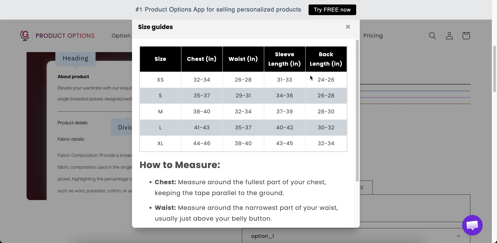

# Size chart

A size table. Start with one of thirteen presets for common garment types, or build your own. It opens from a link on the product page, so it takes no space in the main form.

If you sell clothing, shoes, or other wearable products, a size chart helps customers choose the right fit and reduces size-related returns.

## What customers see

A link with your chart header. Selecting it opens the table at the width you set.

<figure><figcaption>
A size chart in the option form, where the customer is actually choosing a size.
</figcaption></figure>

## Basic Settings

<table><thead><tr><th width="250">Setting</th><th>What it does</th></tr></thead><tbody><tr><td><strong>Chart title</strong></td><td>The heading inside the chart. Starts as <code>Size chart</code>.</td></tr><tr><td><strong>Chart header</strong></td><td>The link text on the product page. Starts as <code>Size guides</code>.</td></tr><tr><td><strong>Chart content</strong></td><td>The table itself. Pick a preset or build your own — see below.</td></tr><tr><td><a href="../shared-settings/conditional-logic-and-add-on-fields.md#conditional-logic">Conditional logic</a></td><td>Show or hide the link.</td></tr></tbody></table>

## Advanced Settings

<table><thead><tr><th width="250">Setting</th><th>What it does</th></tr></thead><tbody><tr><td><strong>Chart icon</strong></td><td>An icon beside the link, from the app's icon picker. A ruler is the obvious choice.</td></tr><tr><td><strong>Chart width</strong></td><td>The width of the opened chart in pixels. Starts at <code>600</code>.</td></tr><tr><td><a href="../shared-settings/direction-width-and-css.md#html-class">HTML class</a> / <a href="../shared-settings/direction-width-and-css.md#column-width">Column width</a></td><td>Styling hook and the width of the link, not the chart.</td></tr></tbody></table>

## The presets

Selecting a preset fills the table with a standard set of measurements for that garment type, which you then replace with your own sizing.

<table><thead><tr><th width="230">Preset</th><th width="230">Preset</th><th>Preset</th></tr></thead><tbody><tr><td>Blank</td><td>Men's Bottoms</td><td>Bra</td></tr><tr><td>Jacket</td><td>Women's Bottoms</td><td>Bikini</td></tr><tr><td>Men's Tops</td><td>Men's Shoes</td><td>Pet Clothing</td></tr><tr><td>Women's Tops</td><td>Women's Shoes</td><td>Pet Collar</td></tr><tr><td>Dress</td><td></td><td></td></tr></tbody></table>

**Blank** gives you an empty table to build yourself.


A preset is a starting point, not your sizing. Replace every measurement with your own. A size chart that does not match the products you ship causes the returns it was meant to prevent.




### Choose the closest preset

The table is filled with that garment type's standard measurements.



### Replace the numbers with your own

Edit the cells directly in the table editor.



### Add or remove rows and columns

Match your real size range, and add any measurement your customers ask about, such as sleeve length, inside leg, or chest at the widest point.



### State the units

Put the units in the **Chart title** or in a header row. `Measurements in cm` answers the most common question.



### Check it on a phone

Wide tables are difficult to read on small screens. If the table is cramped, reduce the number of columns rather than the width.



## Where to place it

Place it directly beside the size option rather than at the bottom of the form. A customer deciding between M and L needs the chart at that point, and will not scroll to find it.

Two arrangements work well:

* The size option, then the size chart link immediately below it.
* A collapsed [Section](section.md) labeled `Size guide` right after the size option.

## Examples

**A garment with your own sizing**

<table><thead><tr><th width="290">Setting</th><th>Value</th></tr></thead><tbody><tr><td>Chart header</td><td><code>Size guide</code></td></tr><tr><td>Chart title</td><td><code>Measurements in cm</code></td></tr><tr><td>Chart content</td><td>From the <strong>Women's Tops</strong> preset, edited to your sizing</td></tr><tr><td>Chart icon</td><td>A ruler</td></tr><tr><td>Chart width</td><td><code>700</code></td></tr></tbody></table>

**Two charts on one product**

One Size chart for clothing measurements and a second for shoe sizes, each displayed by conditional logic based on the product type the customer selected.

**A pet product**

Built from the **Pet Collar** preset, with your own neck measurements and a note on how to measure.

## Notes

* Available on the Advanced plan.
* Works in Shopify POS.
* The content can be translated for each storefront language. See [Translate option content](../../translations/translate-option-content.md).
* Each Size chart option holds one table. For several tables, add several options and display them with conditional logic.
