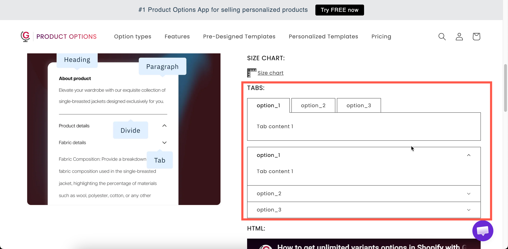

# Tabs

Several content blocks, with one visible at a time. Customers select a tab to switch between panels.

Use tabs when you have three or four types of information to display but want to keep the page compact, such as care instructions, delivery details, return policies, or materials.

## What customers see

A row or column of tab titles with one panel open. Selecting another title switches panels.

<figure><figcaption></figcaption></figure>

## Settings

<table><thead><tr><th width="250">Setting</th><th>What it does</th></tr></thead><tbody><tr><td><strong>Tabs</strong></td><td>The tabs themselves. Each has a title and its own rich-text content.</td></tr><tr><td><a href="../shared-settings/direction-width-and-css.md#direction-style">Direction style</a></td><td><strong>Horizontal</strong> — titles in a row above the content. <strong>Vertical</strong> — titles in a column beside it. Starts on <strong>Horizontal</strong>.</td></tr><tr><td><a href="../shared-settings/conditional-logic-and-add-on-fields.md#conditional-logic">Conditional logic</a></td><td>Show or hide the whole tab set.</td></tr><tr><td><a href="../shared-settings/direction-width-and-css.md#html-class">HTML class</a> / <a href="../shared-settings/direction-width-and-css.md#column-width">Column width</a></td><td>Styling hook and width.</td></tr></tbody></table>

### Building the tabs

Tabs are managed in a values table, in the same way as a selection type's option values, but each entry is a panel rather than a choice.

<table><thead><tr><th width="230">Action</th><th>How</th></tr></thead><tbody><tr><td>Add a tab</td><td><strong>Add another tab</strong> below the table.</td></tr><tr><td>Set a tab's title</td><td>The value field on its row.</td></tr><tr><td>Write a tab's content</td><td>Open the content editor on that row. Rich text, like a <a href="paragraph.md">Paragraph</a>.</td></tr><tr><td>Reorder tabs</td><td>Drag the rows. The first tab is the one open by default.</td></tr><tr><td>Delete a tab</td><td>The remove action on its row.</td></tr><tr><td>Start over</td><td><strong>Delete all tabs</strong>, which asks you to confirm.</td></tr></tbody></table>

Tab titles follow the same character rules as option values. The characters `,` `:` `"` `'` and `|` are not allowed. See [Working with option values](../../option-sets/option-values.md).

### Horizontal or vertical

<table><thead><tr><th width="200">Direction</th><th>Suits</th><th>Watch out for</th></tr></thead><tbody><tr><td><strong>Horizontal</strong></td><td>Two to four tabs with short titles</td><td>Long titles wrap and the row gets messy on mobile</td></tr><tr><td><strong>Vertical</strong></td><td>Longer titles, or five or more tabs</td><td>Takes horizontal space, so it needs a wide column</td></tr></tbody></table>

Keep titles to one or two words. `Care`, `Delivery`, and `Returns` read better than `How to care for your item`.

## Tab order

The first tab is open when the page loads, so put your most important content there. Customers may not notice the other tabs. If `Delivery` is first, for example, many customers never open `Care`.

## Tabs, modal, or paragraph?

<table><thead><tr><th width="200">Use</th><th>When you have</th></tr></thead><tbody><tr><td><a href="paragraph.md">Paragraph</a></td><td>One short piece of text everybody should read</td></tr><tr><td><a href="pop-up-modal.md">Pop-up modal</a></td><td>One longer piece most customers will skip</td></tr><tr><td><strong>Tabs</strong></td><td>Several pieces, at least one of which most customers will read</td></tr></tbody></table>

## Examples

**Care, delivery, returns**

<table><thead><tr><th width="290">Setting</th><th>Value</th></tr></thead><tbody><tr><td>Tabs</td><td><code>Care</code>, <code>Delivery</code>, <code>Returns</code></td></tr><tr><td>Direction style</td><td><strong>Horizontal</strong></td></tr><tr><td>First tab</td><td><code>Care</code> — the one customers ask about most</td></tr></tbody></table>

**Materials and specification**

Two tabs, `Materials` and `Specification`, each with a short formatted list. Use **Vertical** if the titles are longer.

**Personalization guidance**

Tabs `How it works`, `Lead times`, and `What we cannot engrave`, displayed by conditional logic only when the customer has chosen to personalize.

## Notes

* Available on the Advanced plan.
* Works in Shopify POS.
* Titles and content can be translated for each storefront language. See [Translate option content](../../translations/translate-option-content.md).
* Tab colors are store-wide. Set **Tab title**, **Tab title active**, **Tab title hover**, **Tab content**, and **Tab border** in **Settings > Design**. See [Colors](../../storefront/colors.md).
* There is no limit on the number of tabs, but more than five makes the tab row difficult to use. For more content than that, use the **Vertical** layout or split it across several sections.
