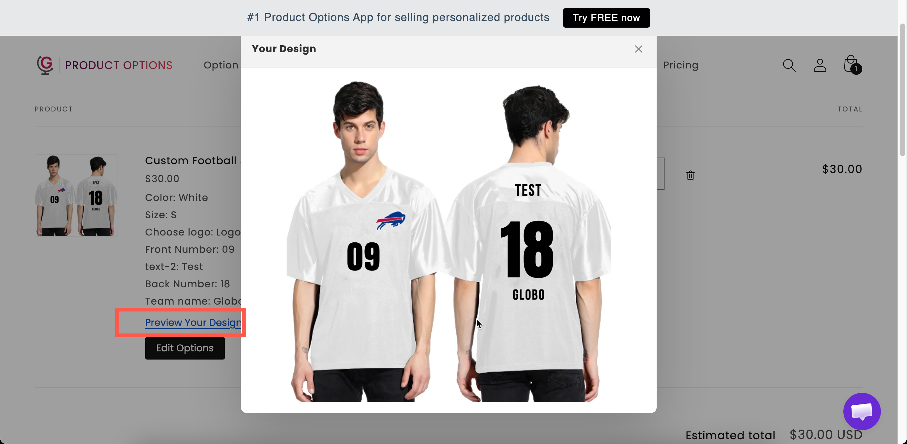

# Designs in cart and orders

This page describes what happens to a personalized design after the customer selects **Add to cart**.

## What the customer sees in the cart

The item is listed with its option details below it: the text the customer entered, the design they selected, and any file they uploaded. This is the same as for any other option.

Personalized items also include a link to view the design. The default wording is **Preview Your Design**, and it can be edited in the widget text.

## Preview mode

How the design is displayed is controlled by a store-wide setting.

**Settings** > **Settings** > **General** > **Cart page** > **Personalize preview mode**

<table><thead><tr><th width="230">Mode</th><th width="290">Behavior</th><th>Use when</th></tr></thead><tbody><tr><td><strong>View in modal</strong></td><td>The design opens in a dialog on the cart page. The default</td><td>Almost always. The customer checks it without leaving the cart</td></tr><tr><td><strong>Download file</strong></td><td>The design is downloaded as a file</td><td>Customers need to keep or forward a copy — approving artwork with a colleague, for instance</td></tr></tbody></table>

**View in modal** is the recommended value. It lets the customer check the design without downloading a file.

This setting may not be available on all plans. See [Compare plans](../plans/compare-plans.md).

<figure><figcaption>
The customer can check their design from the cart before paying.
</figcaption></figure>

## Letting customers change their mind

**Show "Edit Options" button in cart**, also under **Settings** > **Settings** > **General** > **Cart page**, lets customers reopen the option form from the cart and change their selections, including their personalization.

Enable this for personalized products. Without it, a customer who finds a typo in their engraving after adding to cart has to remove the item and start again.

This setting may not be available on all plans. See [Cart page](../storefront/cart-page.md).

## What you see on the order

The order in Shopify admin lists the item with its option details: the text, the selected values, and links to any uploaded files.

Your production team works from these details. Two settings determine how clear they are:

<table><thead><tr><th width="290">Do this</th><th>Because</th></tr></thead><tbody><tr><td>Give every option a readable <strong>Name</strong></td><td>The Name is what appears on the order. <code>Engraving text: Forever yours</code> is actionable; <code>text: Forever yours</code> is not. See <a href="../option-types/shared-settings/labels-and-visibility.md">Label and Name</a></td></tr><tr><td>Include everything production needs as an option</td><td>If the font matters, ask for it as a <a href="../option-types/selection-types/font-picker.md">Font picker</a> option so it is recorded, rather than relying on a default nobody wrote down</td></tr></tbody></table>

## Getting the details out of Shopify admin

There are three options, depending on how your team works:

<table><thead><tr><th width="290">Route</th><th>Good for</th></tr></thead><tbody><tr><td>Reading the order in Shopify admin</td><td>Low volume. Nothing to set up</td></tr><tr><td>Order confirmation emails, invoices, and packing slips</td><td>Anybody who works from printed paperwork. Option details appear automatically. See <a href="../storefront/show-options-on-orders.md">Show options on orders</a></td></tr><tr><td>An <a href="../automations/">automation</a></td><td>Higher volume — email yourself the options as each order arrives, or write them into the order notes so they appear everywhere the note does</td></tr></tbody></table>

If you sell personalized products regularly, set up the automations early. See [Email notification](../automations/email-notification.md) and [Update order notes](../automations/update-order-notes.md).

## Uploaded files

Uploaded files are attached to the order, so your team can download the originals from the order in Shopify admin.

Two points to note:

* State the resolution you need in the option's [help text](../option-types/shared-settings/placeholder-and-help-text.md#help-text). The preview also displays low-resolution files that are not suitable for printing.
* Enable the upload option's image editor so customers crop their own photos before uploading. See [File upload](../option-types/input-types/file-upload.md).

## Set expectations about the preview

The preview is a representation, not a print proof. Screens are not color-calibrated, and final placement can vary slightly.

Add a line of help text such as "The preview is a guide. Colors may vary slightly from your screen."

For high-value personalized items, add your own proofing step. Use a [Switch](../option-types/input-types/switch.md) that offers an emailed proof before production, either free or priced.

## Notes

* Option values, including personalization text, reach the order as line item properties. See [Line item properties](../storefront/show-options-on-orders.md).
* Add-on products attached to personalization appear as their own cart lines unless you merge them. See [Merge main product and add-ons](../add-on-pricing/merge-as-bundle.md).
* Orders keep the option names they were placed with. Renaming an option later does not change existing orders.
* The **Preview Your Design** and **Your Design** wording can be edited for each language under **Settings > Translations**.
