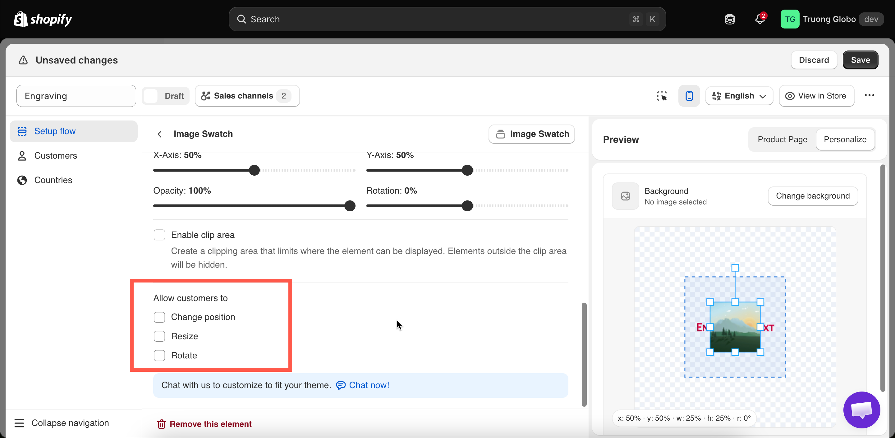

# Customer controls

**Allow customers to** controls which adjustments the customer can make to a layer directly on the product image.

These permissions let the customer arrange the design themselves. They can also produce designs you cannot produce, so always use them together with a clip area.

**Applies to:** all twelve option types that support the Personalizer.

## The three permissions

<table><thead><tr><th width="230">Permission</th><th>What the customer can do</th></tr></thead><tbody><tr><td><strong>Change position</strong></td><td>Drag the layer around the image</td></tr><tr><td><strong>Resize</strong></td><td>Make the layer larger or smaller</td></tr><tr><td><strong>Rotate</strong></td><td>Turn the layer</td></tr></tbody></table>

All three are off by default, and you can enable any combination. With none enabled, the layer stays where you placed it, and the customer changes its content only.

<figure><figcaption>
Three permissions, all off by default.
</figcaption></figure>

## Always pair them with a clip area


If you enable any of these permissions, set a [clip area](clip-area.md) as well.

Without one, a customer can drag their photo onto the handle of a mug, resize their text to cover the whole product, or rotate a design to an angle you cannot print. The preview displays the result, and the order is placed with it.

A clip area limits their adjustments to the area you can produce on.


When customers can drag a layer, leave the clip area outline **visible** and do not enable **Hide clip area**. The outline shows them the area they can work in.

## When to enable them

<table><thead><tr><th width="290">Situation</th><th>Enable</th><th>Why</th></tr></thead><tbody><tr><td>A customer photo in a frame</td><td><strong>Change position</strong>, <strong>Resize</strong></td><td>Only they know which part of their photo matters</td></tr><tr><td>A logo on a garment</td><td><strong>Change position</strong>, <strong>Resize</strong></td><td>Placement is part of what they are buying</td></tr><tr><td>An engraved name on a plate</td><td>Nothing</td><td>You know where the plate is. Let them type, not position</td></tr><tr><td>A design chosen from your own list</td><td>Nothing</td><td>You positioned it correctly already</td></tr><tr><td>A free-form collage or sticker layout</td><td>All three</td><td>The arrangement is the product</td></tr><tr><td>Text on a curved surface</td><td>Nothing</td><td><a href="curve-and-auto-fit.md">Curve</a> handles it better than a customer can</td></tr></tbody></table>

Enable these permissions when **placement is the customer's decision**. Leave them off when placement is **a production constraint**.

## Rotation

Rotation causes the most problems. A rotated engraving is often not producible, and a slightly rotated photo in a frame looks like an error.

Enable it only where an angled result is a valid product, such as a free-form collage, a scattered sticker layout, or a hand-arranged design.

## What the customer sees

With any permission enabled, selecting the layer on the product image displays handles. The app also displays short instructions telling the customer to drag to move the layer, and to use the handles to resize or rotate it.

This wording is part of the widget text and can be edited for each language under **Settings > Translations**. See [Translate widget text](../../translations/translate-widget-text.md).

## Where their adjustments go

The customer's final arrangement is included in the design stored with the order, so you produce what they arranged.

Your position, size, and rotation settings are the **starting point** the customer adjusts from, so set them correctly. A layer that starts in the right place requires fewer adjustments.

See [Designs in cart and orders](../cart-and-orders.md).

## Example configuration

A photo frame where the customer positions their own photo:

<table><thead><tr><th width="290">Setting</th><th>Value</th></tr></thead><tbody><tr><td>Option</td><td>File upload, required, image editor on</td></tr><tr><td>Image shape</td><td>Matching the frame aperture</td></tr><tr><td>Background mode</td><td><strong>Cover</strong></td></tr><tr><td>Position and size</td><td>Filling the aperture — a sensible starting point</td></tr><tr><td>Clip area</td><td>On, matching the aperture, outline visible</td></tr><tr><td>Allow customers to</td><td><strong>Change position</strong>, <strong>Resize</strong></td></tr><tr><td>Rotate</td><td>Off</td></tr><tr><td>Help text</td><td><code>Drag your photo to position it. Anything outside the frame will not be printed.</code></td></tr></tbody></table>

## Notes

* Permissions are per layer, so one layer can be adjustable while another is fixed.
* They affect the preview and the recorded design only. They do not affect other layers.
* Both touch and mouse input are supported, but a small layer is difficult to position on a phone. Do not rely on precise dragging on mobile.
* State in the help text what happens to any part of the design outside the printable area.
