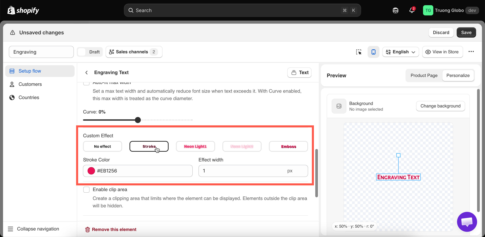

# Text effects

**Custom Effect** applies a visual treatment to a text layer. Select an effect that matches the product you produce.

**Applies to:** [Text](../../option-types/input-types/text.md), [Textarea](../../option-types/input-types/textarea.md), [Number](../../option-types/input-types/number.md).

## The five effects

<table><thead><tr><th width="200">Effect</th><th width="290">Appearance</th><th>Reveals</th></tr></thead><tbody><tr><td><strong>No effect</strong></td><td>Plain text. The default</td><td>Nothing</td></tr><tr><td><strong>Stroke</strong></td><td>An outline around each letter</td><td><strong>Stroke Color</strong>, <strong>Effect width</strong></td></tr><tr><td><strong>Neon Light 1</strong></td><td>A glowing outline</td><td>Nothing</td></tr><tr><td><strong>Neon Light 2</strong></td><td>A second glow treatment</td><td>Nothing</td></tr><tr><td><strong>Emboss</strong></td><td>A raised or pressed look, using a shadow</td><td><strong>Shadow X-Axis</strong>, <strong>Shadow Y-Axis</strong></td></tr></tbody></table>

<figure><figcaption>
Each effect is previewed as you select it, so choose by eye.
</figcaption></figure>

## Stroke

An outline in a color you select.

<table><thead><tr><th width="230">Setting</th><th width="170">Default</th><th>What it does</th></tr></thead><tbody><tr><td><strong>Stroke Color</strong></td><td>A pink</td><td>The outline color</td></tr><tr><td><strong>Effect width</strong></td><td><code>1</code> px</td><td>The thickness of the outline</td></tr></tbody></table>

**When to use it**

A stroke can be decorative, but its main purpose is **keeping text readable over a photograph**. Light text with a thin dark stroke remains legible over uploaded photos, regardless of how light or dark they are.

If customers can upload their own images and you place text over them, use a stroke. You cannot predict whether their photos will be light or dark.

Keep **Effect width** low. Above about `2`, the outline can start to obscure the letters.

## Neon Light 1 and Neon Light 2

Two glow effects with no additional settings.

Use them for products designed to emit light, such as LED signs, acrylic light panels, and neon-style displays. They are not suitable for engraved products.

The two effects create different glow styles. Compare both with your own background image to choose the one that looks best.

## Emboss

Creates a raised or pressed appearance by using a positioned shadow.

<table><thead><tr><th width="230">Setting</th><th width="170">Default</th><th>What it does</th></tr></thead><tbody><tr><td><strong>Shadow X-Axis</strong></td><td><code>1</code> px</td><td>Horizontal shadow offset, from -100 to 100</td></tr><tr><td><strong>Shadow Y-Axis</strong></td><td><code>1</code> px</td><td>Vertical shadow offset, from -100 to 100</td></tr></tbody></table>

**How to position the shadow**

The shadow offset determines the lighting direction. Small offsets create a subtle, physical impression, while larger offsets make the effect look more like a drop shadow.

<table><thead><tr><th width="290">Effect wanted</th><th>Try</th></tr></thead><tbody><tr><td>Pressed into the surface — debossed</td><td>Small positive values, around <code>1</code> to <code>2</code></td></tr><tr><td>Raised off the surface — embossed</td><td>Small negative values</td></tr><tr><td>Matching your photograph's lighting</td><td>Offset in the same direction as the shadows already in the image</td></tr></tbody></table>

Match the shadow direction to the lighting in your product photo. If the light comes from the top left, the shadow should fall toward the bottom right.

## Choosing an effect

<table><thead><tr><th width="290">Product</th><th>Effect</th></tr></thead><tbody><tr><td>Engraved metal or wood</td><td><strong>Emboss</strong> with small offsets, or <strong>No effect</strong></td></tr><tr><td>Printed text on fabric or paper</td><td><strong>No effect</strong></td></tr><tr><td>Text over a customer's uploaded photo</td><td><strong>Stroke</strong>, thin, in a contrasting color</td></tr><tr><td>LED or acrylic light products</td><td><strong>Neon Light 1</strong> or <strong>Neon Light 2</strong></td></tr><tr><td>Vinyl or sticker lettering</td><td><strong>Stroke</strong> matching your cut outline</td></tr><tr><td>Embroidery</td><td><strong>No effect</strong>, with a font that suits stitching</td></tr></tbody></table>


Choose the effect that most closely matches the actual product you produce. If a customer sees a glowing preview but receives flat engraving, the order may be correct, but the preview was misleading.


## Notes

* You can apply one effect per layer.
* Effects apply to the entire layer, not to individual parts of the text.
* Effects are drawn on top of the layer's [Text color](text-layers.md#text-color), so check both settings together.
* Effects apply to the preview only. They do not affect the actual product or production process.
* Thick strokes and large shadows on long text can take longer to render, which may be noticeable on older devices.
