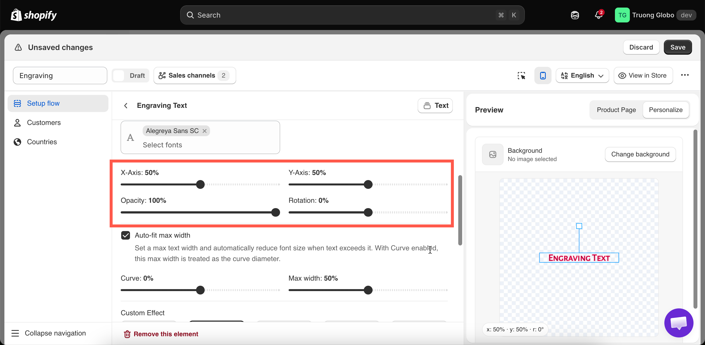

# Position, size, and rotation

Every layer, text or image, is positioned with the same settings.

## The settings

<table><thead><tr><th width="200">Setting</th><th width="150">Range</th><th width="130">Default</th><th>What it does</th></tr></thead><tbody><tr><td><strong>X-Axis</strong></td><td>0 – 100%</td><td><code>50</code></td><td>Horizontal position. 0 is the left edge, 100 the right</td></tr><tr><td><strong>Y-Axis</strong></td><td>0 – 100%</td><td><code>50</code></td><td>Vertical position. 0 is the top, 100 the bottom</td></tr><tr><td><strong>Width</strong></td><td>0 – 100%</td><td><code>25</code></td><td>The layer's width as a share of the image. Image layers and Textarea only</td></tr><tr><td><strong>Height</strong></td><td>0 – 100%</td><td><code>25</code></td><td>The layer's height. Image layers and Textarea only</td></tr><tr><td><strong>Opacity</strong></td><td>0 – 100%</td><td><code>100</code></td><td>Transparency. 100 is solid</td></tr><tr><td><strong>Rotation</strong></td><td>-180 – 180°</td><td><code>0</code></td><td>Rotation in degrees. Negative is anticlockwise</td></tr></tbody></table>

All position values are **percentages of the image**, not pixels. This keeps the layer in the same relative place whether the image is displayed on a phone or a large monitor.

<figure><figcaption>
Positions are percentages of the image, so they hold at any display size.
</figcaption></figure>

## Which types get width and height

<table><thead><tr><th width="290">Type</th><th>Width and height</th><th>Instead they get</th></tr></thead><tbody><tr><td>Image layers — File upload and the eight selection types</td><td><strong>Yes</strong></td><td></td></tr><tr><td>Textarea</td><td><strong>Yes</strong> — it is a block of text</td><td></td></tr><tr><td>Text and Number</td><td>No</td><td><a href="curve-and-auto-fit.md">Curve and Auto-fit max width</a></td></tr></tbody></table>

Text and Number are single-line types. They are sized by the font size and grow as the customer types, so they use auto-fit instead of a fixed width.

## How to position a layer



### Start from the middle

Both axes default to 50, which places the layer in the center. Adjust from there.



### Set the vertical position first

**Y-Axis** is usually easier to set, because the print or engraving area is at a known height on the product.



### Then the horizontal position

**X-Axis** at 50 centers the layer, which is correct for most personalization.



### Size it

Image layers: set **Width** and **Height**. Text layers: adjust **Font size** on the [text layer settings](text-layers.md).



### Rotate only if the product needs it

Rotate a layer only to match a slanted surface or an intended design. On a straight product, rotation looks incorrect.



### Test with the extremes

Test a one-character entry and a maximum-length entry, and both a tall and a wide uploaded image. Positioning problems appear at these extremes.



### Check it on mobile

The percentages are the same, but a layer that is readable on a desktop preview can be too small on a phone.



## Opacity

<table><thead><tr><th width="230">Value</th><th>Use for</th></tr></thead><tbody><tr><td><code>100</code></td><td>Almost everything. Printing and engraving are opaque</td></tr><tr><td><code>60</code>–<code>90</code></td><td>Etched glass, watermarks, subtle tone-on-tone printing</td></tr><tr><td>Below <code>50</code></td><td>Rarely. The customer may think their text has not registered</td></tr></tbody></table>

If a layer does not sit well against the photo, adjust the color before reducing the opacity.

## Rotation

<table><thead><tr><th width="230">Value</th><th>Use for</th></tr></thead><tbody><tr><td><code>0</code></td><td>Almost everything</td></tr><tr><td>A few degrees either way</td><td>Matching a product photographed slightly off-square</td></tr><tr><td><code>90</code> or <code>-90</code></td><td>Text running up the side of a product — a spine, a pen barrel</td></tr><tr><td><code>180</code></td><td>Rarely useful outside deliberate design</td></tr></tbody></table>

For text on a curved surface, such as around a mug or a ring, use [Curve](curve-and-auto-fit.md) instead of rotation. Rotation turns the whole line, while curve bends it.

## Several layers on one image

<table><thead><tr><th width="290">Goal</th><th>How</th></tr></thead><tbody><tr><td>A name above a date</td><td>Same <strong>X-Axis</strong>, different <strong>Y-Axis</strong> — for example 40 and 55</td></tr><tr><td>Two layers side by side</td><td>Same <strong>Y-Axis</strong>, different <strong>X-Axis</strong> — for example 30 and 70</td></tr><tr><td>Text over an uploaded photo</td><td>Position the text within the photo layer's area, and give it a <a href="effects.md#stroke">stroke</a> for contrast</td></tr><tr><td>Layers that must never overlap the product edge</td><td>Give each a <a href="clip-area.md">clip area</a></td></tr></tbody></table>

## Notes

* Percentages are relative to the background image, so positions stay accurate across products only if your photos are framed consistently. See [Choosing the background](../setup.md#choosing-the-background).
* If you let customers move a layer, your position is their starting point. See [Customer controls](customer-controls.md).
* A [clip area](clip-area.md) limits where a layer can appear. Use one whenever customers can move a layer.
* Changing the background moves every layer. Set the background first.
