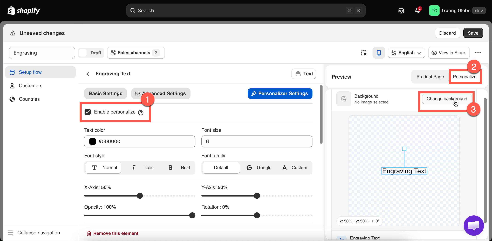
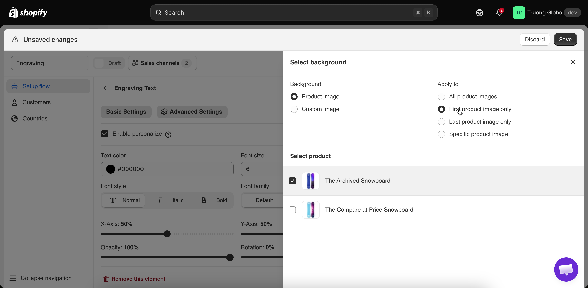
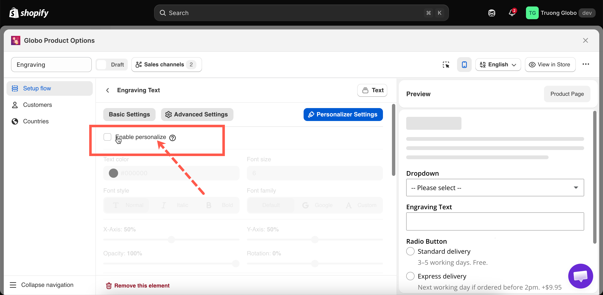

# Set up the Personalizer

A live preview requires two things: a **background** and one or more **layers**.

The background belongs to the **option set**, and the layers belong to individual **options**. Layer positions are measured against the background, so set the background first. If you change it later, you have to reposition every layer.

## The three parts

<table><thead><tr><th width="180">Part</th><th width="230">What it is</th><th>Where you set it</th></tr></thead><tbody><tr><td><strong>The background</strong></td><td>The image the layers are drawn on — a product photo, or one you upload</td><td>Once per option set, from the builder's preview panel</td></tr><tr><td><strong>The layers</strong></td><td>One per option with the Personalizer on. Text or image</td><td>Per option, on its <strong>Personalizer Settings</strong> tab</td></tr><tr><td><strong>Customer controls</strong></td><td>Which layers the customer may move, resize, or rotate</td><td>Per option, per layer</td></tr></tbody></table>

## The order to work in

Set the background first, then complete the following steps:

1. **Set the background.** See [Choosing the background](setup.md#choosing-the-background) below.
2. **Build the options.** Set labels, limits, prices, and conditional logic. See [Build your options](../option-sets/build-options.md).
3. **Turn the Personalizer on for each option.** See [Turning it on for an option](setup.md#turning-it-on-for-an-option) below.
4. **Style and position each layer.** See [Layer settings](layer-settings/).
5. **Select what the customer can adjust.** See [Customer controls](layer-settings/customer-controls.md). Add a [clip area](layer-settings/clip-area.md) if you allow any adjustment.
6. **Test on a real product page** using **View in Store**. Enter realistic content, such as a full name rather than `test`, and check the result on a phone.

## Choosing the background

Select **Change background** in the preview panel. You then choose which image to use, and which of the product's images it applies to.

<figure><figcaption></figcaption></figure>

<figure><figcaption>
Two decisions: which image, and which of the product’s images it applies to.
</figcaption></figure>

### Product image or custom image

<table><thead><tr><th width="200">Choice</th><th width="250">What it uses</th><th>Best for</th></tr></thead><tbody><tr><td><strong>Product image</strong></td><td>The product's own photographs. You also pick a product to preview against while you work in the builder; on the storefront each customer's actual product is used</td><td>Almost everything. One option set works across a whole catalog, and every product shows its own photo</td></tr><tr><td><strong>Custom image</strong></td><td>One image you upload, used for every product this option set applies to</td><td>Products that photograph badly for personalization, or where a clean mock-up sells better than the real photo</td></tr></tbody></table>

Selecting **Custom image** also displays the **When to replace product image** setting.

### Apply to: which of the product images

With **Product image** selected, this setting controls which photograph the layers are drawn on.

<table><thead><tr><th width="250">Choice</th><th width="200">Behavior</th><th>Use when</th></tr></thead><tbody><tr><td><strong>All product images</strong></td><td>Every image gets the layers</td><td>All your photographs show the same personalizable face</td></tr><tr><td><strong>First product image only</strong></td><td>Only the first</td><td>The first image is your clean front-on shot and the rest are details</td></tr><tr><td><strong>Last product image only</strong></td><td>Only the last</td><td>You keep a dedicated personalization mock-up at the end of the gallery</td></tr><tr><td><strong>Specific product image</strong></td><td>The one at the position number you enter</td><td>Your personalizable shot is always, say, the third image</td></tr></tbody></table>


**All product images** is rarely the right choice. A layer positioned for a front-facing photo may appear in the wrong place on close-up or lifestyle photos.

Select a single product image and keep it in the same gallery position across your products. **First product image only**, using a consistent front-facing photo, is the most reliable option. **Specific product image** requires all product galleries to use the same image order, so check several products before using this setting.


### When to replace product image

This setting is displayed only when **Custom image** is selected. It controls when the customer sees your uploaded image instead of the product photo.

<table><thead><tr><th width="250">Choice</th><th width="230">Behavior</th><th>Use when</th></tr></thead><tbody><tr><td><strong>Immediately on page load</strong></td><td>Your image is shown from the start</td><td>The mock-up is the best sales image you have</td></tr><tr><td><strong>Only after personalization</strong></td><td>The product photo shows first; your image appears once they start personalizing</td><td>The real photograph sells better, and the mock-up is only there to show their design</td></tr></tbody></table>

**Only after personalization** is usually the better choice. Customers see the real product first, and your image appears when they start personalizing.

What makes a good background photograph

The quality of the preview depends on this image.

<table><thead><tr><th width="290">Do</th><th>Avoid</th></tr></thead><tbody><tr><td>A flat, front-on view of the surface being personalized</td><td>Angled or three-quarter shots — flat text on a perspective surface looks wrong</td></tr><tr><td>Even, diffuse lighting</td><td>Strong shadows or highlights across the personalization area</td></tr><tr><td>A plain area where the text will sit</td><td>Busy patterns behind the text</td></tr><tr><td>Consistent framing across your products</td><td>Different crops per product, when one option set covers many</td></tr><tr><td>Large enough to stay sharp on a big screen</td><td>Small images that soften when scaled up</td></tr></tbody></table>

If your products are photographed at an angle, use a flat **Custom image** mock-up instead. It is less authentic but produces a more accurate preview.

## Turning it on as an option

Open the option and go to the **Personalizer Settings** tab, beside **Basic Settings** and **Advanced Settings**. Turn on **Enable personalize**. No other settings are displayed until you do.

The tab is available on the [twelve supported option types](./#the-twelve-supported-option-types) only. If the tab is missing, the option type does not support the Personalizer. If it is greyed out, the Personalizer is not included in your plan.

<figure><figcaption>
Nothing on the tab appears until the switch is on.
</figcaption></figure>

### What you get by option type

The available settings depend on whether the option produces text or an image.

<table><thead><tr><th width="290">Setting group</th><th width="230">Text, Textarea, Number</th><th>File upload and the eight selection types</th></tr></thead><tbody><tr><td>Color, font size, font style, font family</td><td><strong>Yes</strong></td><td>No</td></tr><tr><td>Text alignment</td><td>Textarea only</td><td>No</td></tr><tr><td>Text effects</td><td><strong>Yes</strong></td><td>No</td></tr><tr><td>Curve and auto-fit max width</td><td>Text and Number only</td><td>No</td></tr><tr><td>Image shape and background mode</td><td>No</td><td><strong>Yes</strong></td></tr><tr><td>Width and height</td><td>Textarea only</td><td><strong>Yes</strong></td></tr><tr><td>X-Axis, Y-Axis, opacity, rotation</td><td><strong>Yes</strong></td><td><strong>Yes</strong></td></tr><tr><td>Clip area</td><td><strong>Yes</strong></td><td><strong>Yes</strong></td></tr><tr><td>Allow customers to</td><td><strong>Yes</strong></td><td><strong>Yes</strong></td></tr></tbody></table>

Text and Number are single-line types, so they support curve and auto-fit instead of width and height. Textarea is a block, so it supports alignment, width, and height. Image types support shape and fit mode.

### Always give a text layer a default value

A text layer with no content is not drawn, so the preview appears empty until the customer enters text.

Set a **Default value** in **Basic Settings**, such as `Your name` or `Your text`. The preview then always has content to display.

The default value is also submitted if the customer does not change it, so choose a suitable value.

Several personalized options on one product

Layers are drawn together on one background, and they can overlap.

<table><thead><tr><th width="290">Combination</th><th>What to watch</th></tr></thead><tbody><tr><td>A name and a date</td><td>Different <strong>Y-Axis</strong> values so they sit on separate lines</td></tr><tr><td>Text over an uploaded photo</td><td>Contrast — dark text on a dark photo disappears. Consider a <a href="layer-settings/effects.md">stroke effect</a></td></tr><tr><td>Two alternative designs, never both</td><td><a href="../conditional-logic/">Conditional logic</a>, so only one is ever visible</td></tr><tr><td>Layers that must stay inside a printable area</td><td>Give each one a <a href="layer-settings/clip-area.md">clip area</a></td></tr><tr><td>Many layers</td><td>Performance on older phones. Keep it to what the product really needs</td></tr></tbody></table>

A hidden option draws no layer, so you can use conditional logic to switch between alternative designs.

What the preview is, and is not

<table><thead><tr><th width="290">It is</th><th>It is not</th></tr></thead><tbody><tr><td>A representation of the finished product, good enough to sell from</td><td>A print-ready proof</td></tr><tr><td>Live, updating as the customer types</td><td>Color-accurate — screens are not calibrated</td></tr><tr><td>A record of what the customer intended</td><td>A guarantee that production will match it exactly</td></tr></tbody></table>

State this where it matters. Add a line of [help text](../option-types/shared-settings/placeholder-and-help-text.md#help-text) such as "The preview is a guide. Final placement may vary slightly."

## Notes

* One background per option set. For products framed very differently, use separate option sets. See [Assign to products](../option-sets/assign-to-products.md).
* Layer positions are percentages rather than pixels, so a layer keeps its relative position at any display size. This works only if your product photos are framed consistently.
* The builder preview uses the product you selected under **Change background**. The storefront uses the product the customer is viewing.
* A custom background image is uploaded to your store's files.
* Turning the Personalizer off leaves the option working normally. It stops drawing the layer, and no settings are lost.
* Layer settings are per option, so the same option type can be configured differently in two places.
* The customer's text or file is stored in the order in both cases. The Personalizer adds the visual design record. See [Designs in cart and orders](cart-and-orders.md).

If the Personalizer does not behave as described here, see [Troubleshooting personalizer](troubleshooting.md).
