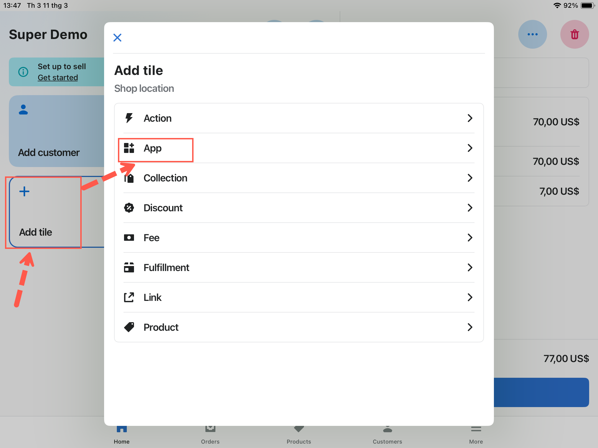
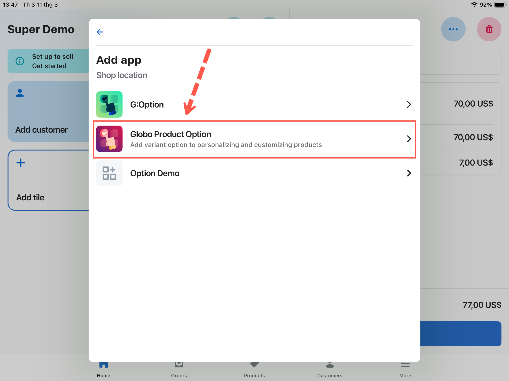
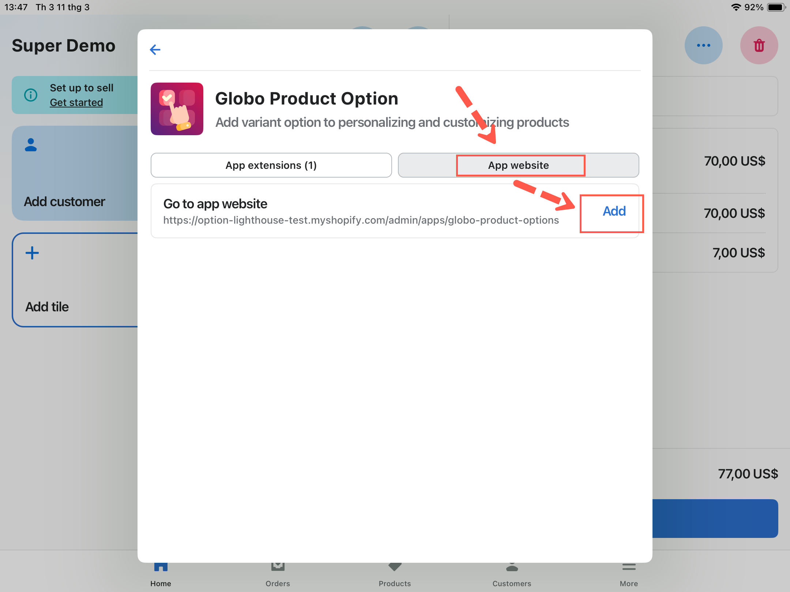
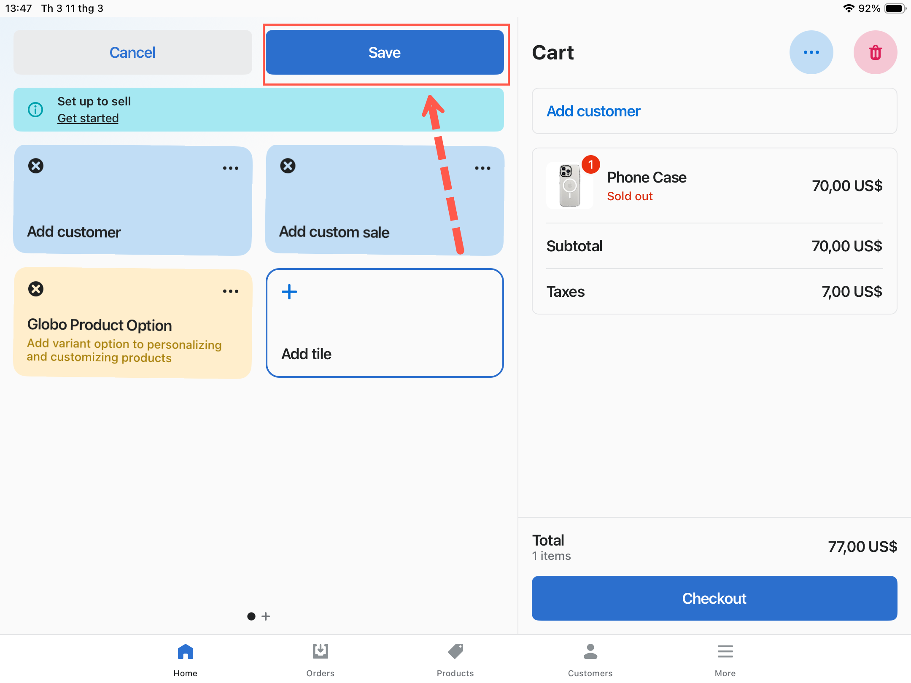

# Set up and use options in POS

## Before you start

* Point of Sale is included in your plan. See [Compare plans](../plans/compare-plans.md).
* You have the Shopify POS app, signed in to your store.
* You have read [POS limitations](limitations.md). Two option types and one add-on mode do not work in POS.

## Set up



### Publish the option set to Point of Sale

Open the option set in the builder and select **Point of Sale** under **Sales channels**, beside the option set's name. Save.

An option set published only to **Online Store** does not appear in POS.



### Check the option set is Active

A **Draft** option set does not run on any channel.



### Review the option types it uses

If the option set contains [Dimension](../option-types/input-types/dimension.md) or [Product links](../option-types/selection-types/product-links.md), those options do not work in POS. Either remove them, or create a separate option set for POS without them.



### Review the add-on modes

Any value using **Add price** is not charged in POS. Change those values to **Use existing product** or **Automatically generate product**. See [Add-on pricing](../add-on-pricing/README.md).



### Add the app tile to the POS home screen

In the Shopify POS app, customize the home screen and add a tile for the app, so staff can open it in one tap.

On the POS smart grid, tap **Add tile**, then tap **App**.

<figure><figcaption>
Tap Add tile on the smart grid, then tap App.
</figcaption></figure>

Select **Globo Product Options, Variant**.

<figure><figcaption>
Select the app from the list of apps installed on your store.
</figcaption></figure>

Tap **App website**, then the **Add** button.

<figure><figcaption>
Open the App website tab and add it as a tile.
</figcaption></figure>

Tap **Save** to finish.

<figure><figcaption>
The tile is on the smart grid once you save.
</figcaption></figure>



<!-- SCREENSHOT: pos-sales-channel | App admin → builder → popover Sales channels | Point of Sale đang được bật | Khoanh dòng Point of Sale -->

<figure><figcaption>
An option set must be published to Point of Sale to appear there.
</figcaption></figure>

## Taking an order at the counter



### Find the product

Use the search bar on the POS **Home** screen. Enter a product name, a variant, or a vendor, and the matching products are listed below it.



### Add an in-stock variant to the cart

Select the variant the customer is buying. Add it the way your staff normally do.



### Open the app from the POS home screen

Tap the app's tile. It lists the items currently in the cart, under **Cart items**.



### Tap **Edit Options** on the item to personalize

You can select any item that has an option set available. You cannot select add-on items already in the cart, because they belong to the item above them.

If the product has no matching option set, the app says **No option sets are being applied for this product.** Check the option set's status, its **Sales channels**, and its product rule. See [POS limitations](limitations.md).



### Complete the options

The option form is displayed, using the same option set as your storefront. Fill in the required fields.

Add-on options are added to the cart as their own products, so the totals update as you go.



### Update the cart

The app confirms with **Cart updated**. Close the app to return to the POS home screen.



### Add a customer or a discount, if you need to

**More actions** in POS covers adding a customer, applying a discount, and the other order tasks. This is Shopify's own flow and is not affected by the app.



### Review the cart and take payment

Check the option details listed under each item in the cart summary, then tap **Checkout** and select the payment method. The options are stored in the order in the same way as online.



<!-- SCREENSHOT: pos-cart-items | Shopify POS → app | Danh sách line item trong cart, 1 item đang được chọn | Khoanh item đang chọn -->

<figure><figcaption>
The app lists the cart under Cart items, with an Edit Options button on each one.
</figcaption></figure>

## Practical advice

<table><thead><tr><th width="290">Do</th><th>Why</th></tr></thead><tbody><tr><td>Keep POS option sets short</td><td>A customer is standing there. A twenty-field form is not a counter experience</td></tr><tr><td>Use a separate option set for POS where the online one is long</td><td>Publish the long one to Online Store only, and a trimmed one to POS only</td></tr><tr><td>Prefer <a href="../option-types/selection-types/button.md">Button</a> and <a href="../option-types/selection-types/radio-button.md">Radio button</a> over dropdowns</td><td>Fewer taps on a touch screen</td></tr><tr><td>Set sensible <a href="../option-types/shared-settings/required-and-default-value.md#default-value">default values</a></td><td>Staff confirm rather than fill in</td></tr><tr><td>Give options obvious labels</td><td>Staff are reading them aloud to a customer</td></tr><tr><td>Train staff to open the app <em>after</em> adding the product</td><td>The app works from what is already in the cart, so an empty cart gives it nothing to edit</td></tr></tbody></table>


Using two option sets is worth the extra setup. Your online form can ask for everything, while your counter form asks only for what staff need while a customer waits. Separate them with **Sales channels**: publish one to Online Store and the other to Point of Sale.


## What is stored in the order

The result is the same as online. The options are attached to the line item, and add-on products appear as their own lines, so your production team sees an in-person order in the same format as an online order.

See [Show options on orders](../storefront/show-options-on-orders.md).

## Notes

* The app must be opened from inside POS, because it reads the current POS cart.
* Add-on lines already in the cart cannot be personalized themselves, because they belong to the item they were added for.
* An option set published to both channels is shared, so a change affects both. Use separate option sets if you want them to differ.
* Country and customer rules apply to the storefront and are not useful for an in-person sale.
