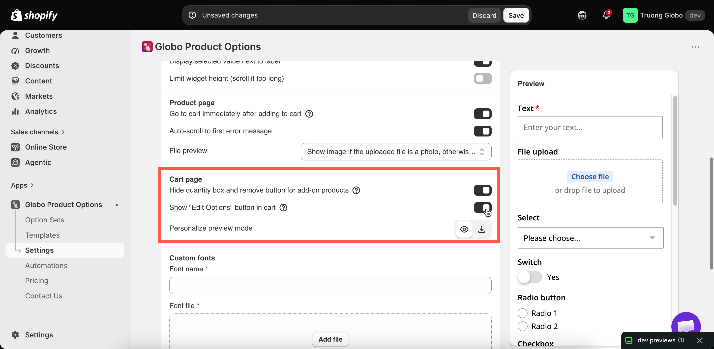
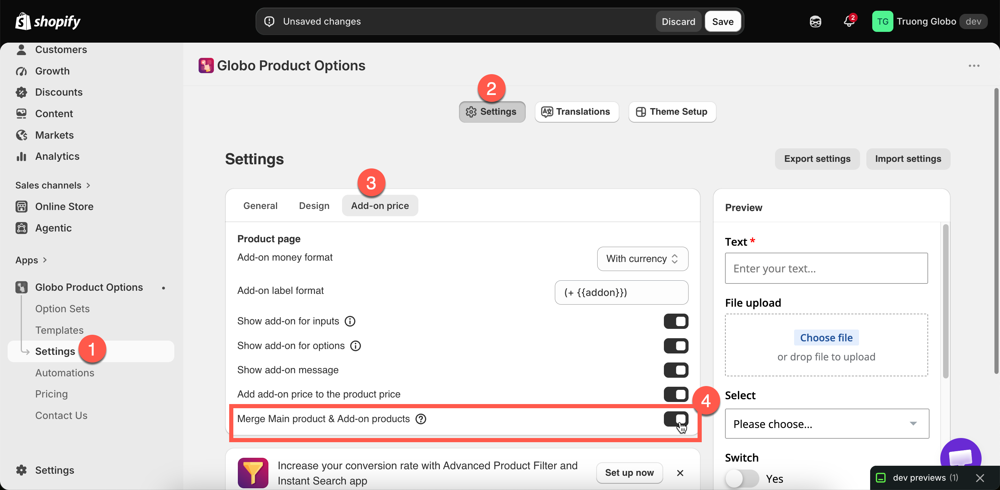

# Cart page

Three settings in **Settings** > **Settings** > **General** > **Cart page**, plus one in the add-on settings, control how a personalized order behaves once it is in the cart.

<figure><figcaption>
Three cart settings, all store-wide.
</figcaption></figure>

## Hide quantity box and remove button for add-on products

| Default | On |
| ------- | -- |

Prevents customers from changing the quantity of an add-on line, or removing it, separately from the item it belongs to.

**Keep this on.** Without it, a customer can remove the gift box while keeping the "gift wrapped" option on the main item, so you receive an order for something that was not paid for.

It applies to product-backed add-ons, because those are the ones with their own cart line. An [Add price](../add-on-pricing/add-price-directly.md) charge has no separate line.

## Show "Edit Options" button in cart

| Default | Off |
| ------- | --- |

Adds a button to the cart line that reopens the option form, so customers can change their choices without removing the item and starting again.

<table><thead><tr><th width="290">Turn it on when</th><th>Leave it off when</th></tr></thead><tbody><tr><td>You sell personalized products, where a typo is likely and costly</td><td>Your options are simple and quick to redo</td></tr><tr><td>Forms are long enough that redoing one is a real deterrent</td><td>You would rather the cart stayed as simple as possible</td></tr><tr><td>You want fewer abandoned carts from small mistakes</td><td></td></tr></tbody></table>

This is worth turning on for personalized products. Without it, a customer who notices a misspelled engraving in the cart has to remove the item and enter everything again.

This setting may not be available on all plans. See [Compare plans](../plans/compare-plans.md).

You can edit the button's text, along with **Cancel** and **Save Changes**, for each language in **Settings** > **Translations**. See [Translate widget text](../translations/translate-widget-text.md).

## Personalize preview mode

| Default | **View in modal** |
| ------- | ----------------- |

This setting controls how a personalized design is displayed from the cart.

<table><thead><tr><th width="230">Mode</th><th>Behavior</th></tr></thead><tbody><tr><td><strong>View in modal</strong></td><td>Opens in a dialog on the cart page</td></tr><tr><td><strong>Download file</strong></td><td>Downloads as a file</td></tr></tbody></table>

Use **View in modal** in most cases, because a customer who has to download a file to check their design often will not. Use **Download file** only when customers need to keep or forward a copy, for example to approve artwork with someone else.

This setting may not be available on all plans, and it applies only if you use the [Personalizer](../personalizer/). See [Designs in cart and orders](../personalizer/cart-and-orders.md).

## Merge main product and add-ons

This setting is on a different page, but it changes the cart more than the three above. **Settings** > **Settings** > **Add-on price** > **Merge Main product & Add-on products** displays add-on lines as part of the main item instead of separately.

It is on by default. See [Merge main product and add-ons](../add-on-pricing/merge-as-bundle.md).

<figure><figcaption></figcaption></figure>

## What the cart always displays

Regardless of these settings, the cart displays the option details under each item: the text the customer entered, the values they selected, and links to any files they uploaded. This happens automatically because option values are stored as line item properties.

See [Show options on orders](show-options-on-orders.md).

## Recommended configuration for personalized products

<table><thead><tr><th width="330">Setting</th><th>Value</th></tr></thead><tbody><tr><td>Hide quantity box and remove button for add-on products</td><td><strong>On</strong></td></tr><tr><td>Show "Edit Options" button in cart</td><td><strong>On</strong></td></tr><tr><td>Personalize preview mode</td><td><strong>View in modal</strong></td></tr><tr><td>Merge Main product &#x26; Add-on products</td><td><strong>On</strong>, unless you want add-on prices itemised</td></tr></tbody></table>

## Notes

* All of these settings are store-wide.
* Two of the three may not be available on all plans.
* The appearance of the cart also depends on your theme, which builds the cart page. Check your own cart after changing any of these settings.
* Options are collected before the cart, so a customer cannot add an option from the cart page. They can only edit the options already on the item.
