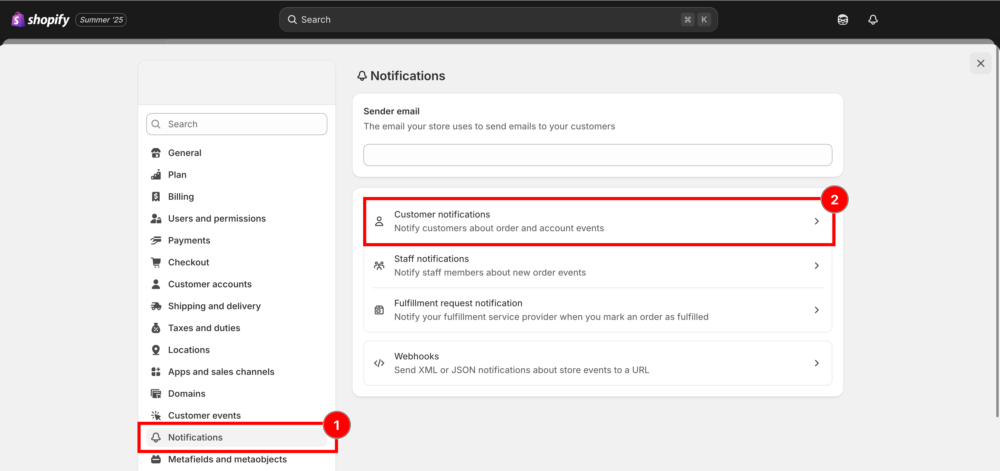
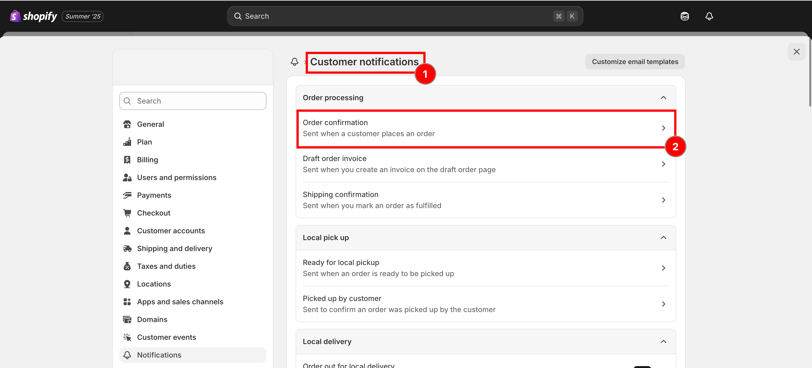
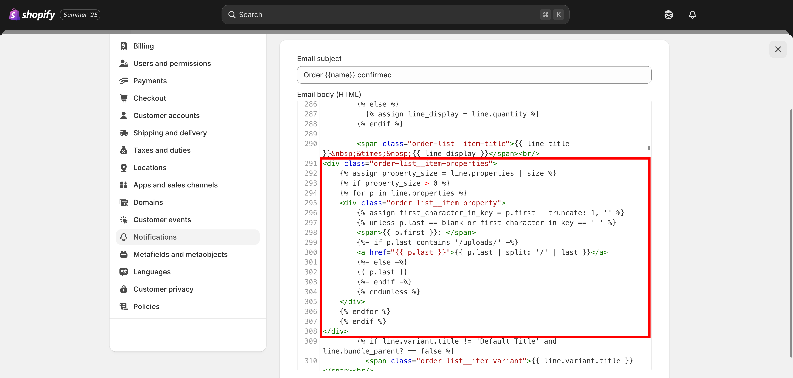

# Display options in confirmation email

This is the email your customer receives right after placing an order. By default, Shopify's order confirmation email doesn't include custom option details — but you can change that!


🔔 **Note:** If you've already customized your email templates, **do not** copy and paste the full code below. Instead, review and merge it carefully.


## 📌 Follow these steps



### From your **Shopify admin**, click on **Settings**, Select **Notifications**

<figure><figcaption><p>Settings, then Notifications.</p></figcaption></figure>



### Under **Customer Notifications**, click **Order confirmation**

<figure><figcaption><p>Customer notifications, then Order confirmation.</p></figcaption></figure>



### **Download the Order Confirmation template**

[Click this button to download](https://github.com/globo-software/display-cart-line-item-in-notification/blob/main/gpo-order-confirmation.liquid)



### **Copy the code** and Paste to Email body (HTML) box

```liquid
<div class="order-list__item-properties">
	 
	 
	 
	<div class="order-list__item-property">
		
		 
		<span>{{ p.first }}: </span>
		 
		<a href="{{ p.last }}">{{ p.last | split: '/' | last }}</a> 
		 
		{{ p.last }} 
		 
		 
	</div> 
	
	 
</div>
```

<figure><figcaption><p>Paste the snippet into the Email body (HTML) box.</p></figcaption></figure>



### **Save**




📧 **Need Help?**

If you run into any issues while setting up your option set, feel free to reach out at **Chat** or email [contact@globo.io](mailto:contact@globo.io).

See [Contact support](../help/contact-support.md).

