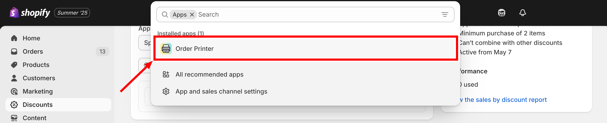
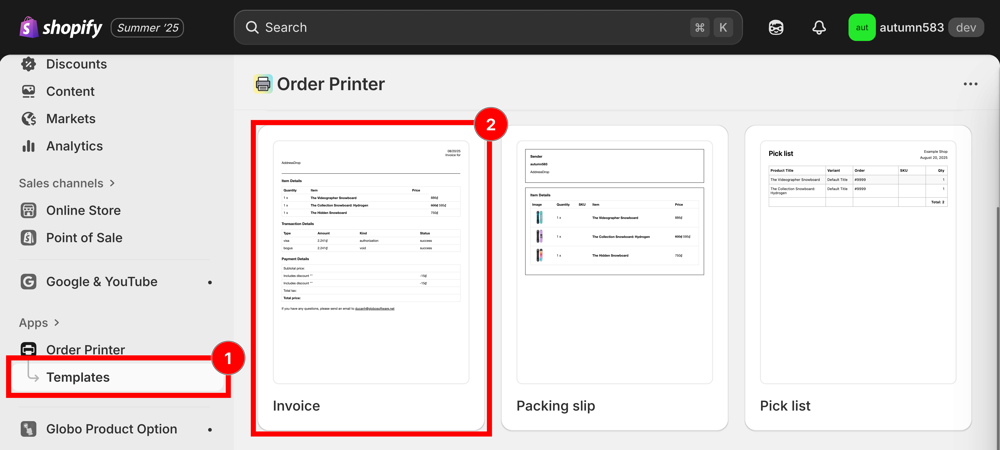
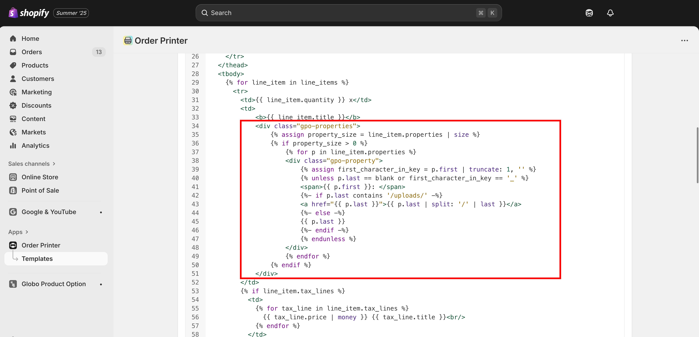

# Display option on order invoice

## Order invoice with Shopify Order Printer

The Product Options app integrates with Shopify's Order Printer, enabling option details to appear on printed invoices.

### Steps to configure



### Access **Apps** from your Shopify admin dashboard



### Locate and select **Order Printer** from your installed apps

<figure><figcaption><p>Open Order Printer from your list of installed apps.</p></figcaption></figure>



### Navigate to **Manage Templates** and choose **Invoice**

<figure><figcaption><p>Manage templates, then open the Invoice template.</p></figcaption></figure>



### Download the invoice template from the provided GitHub repository

[Click this button to download](https://github.com/globo-software/display-cart-line-item-in-notification/blob/main/gpo-order-invoice.liquid)



### Copy this code snippet into the Template Details section

```liquid
<div class="gpo-properties">
	 
	 
	 
	<div class="gpo-property">
		
		 
		<span>{{ p.first }}: </span>
		 
		<a href="{{ p.last }}">{{ p.last | split: '/' | last }}</a> 
		 
		{{ p.last }} 
		 
		 
	</div> 
	
 
</div>
```

<figure><figcaption><p>Paste the snippet into the Template Details section.</p></figcaption></figure>



### Click **Save** to finalize changes



### Support


📩 **Need help?** If you run into any issues creating a new option set, don't hesitate to reach out! Email us anytime at [**contact@globo.io**](mailto:contact@globo.io) — we're here to help with sincere support.

See [Contact support](../help/contact-support.md).

