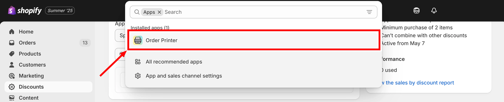
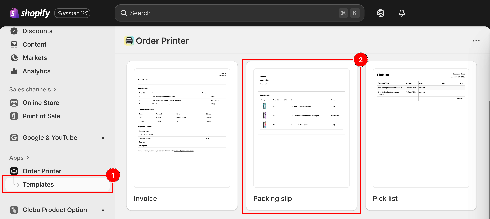
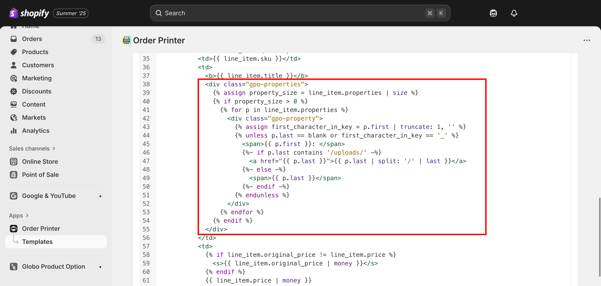
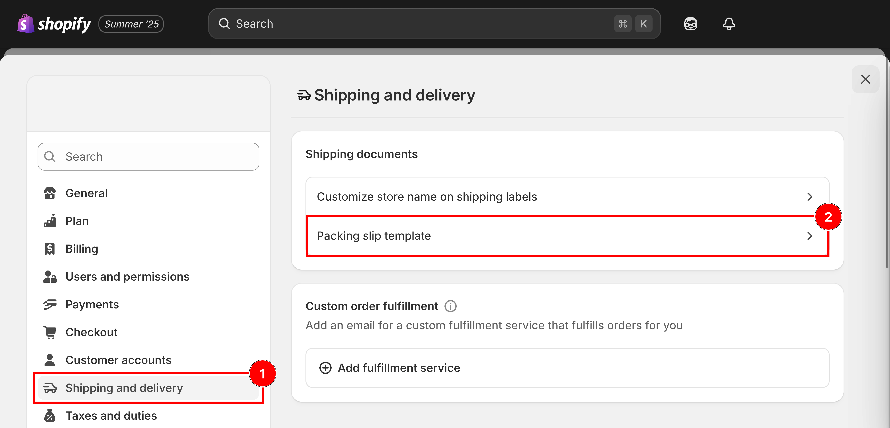
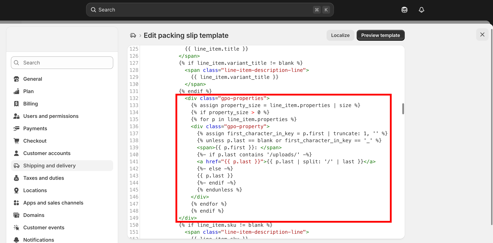

# Display options in packing slip

There are two ways to do this. Use whichever matches how you print your packing slips.

## Using Shopify Order Printer

Our **Product Options** app works with Shopify's **Order Printer** app, so you can include custom option details right on your packing slips.



### From your **Shopify admin**, click on **Apps**



### Select **Order Printer** from your app list

<figure><figcaption><p>Open Order Printer from your app list.</p></figcaption></figure>



### Click **Manage Templates** > **Packing slip**

<figure><figcaption><p>Manage templates, then open the Packing slip template.</p></figcaption></figure>



### **Download the packing slip template**

[Click this button to download](https://github.com/globo-software/display-cart-line-item-in-notification/blob/main/gpo-packing-slip-template-order-printer.liquid)



### **Copy the code** and **paste to Template Details** section

```liquid
 <div class="gpo-properties">
     
     
       
        <div class="gpo-property">
          
           
            <span>{{ p.first }}: </span>
             
              <a href="{{ p.last }}">{{ p.last | split: '/' | last }}</a> 
             
              <span>{{ p.last }}</span>
             
           
        </div> 
      
     
  </div>
```

<figure><figcaption><p>Paste the snippet into the Template Details section.</p></figcaption></figure>



### **Save the change**



## Through Shopify settings

This method lets you directly update Shopify's built-in packing slip template from your store's settings.



### From your **Shopify admin**, click on **Settings**



### Go to **Shipping and Delivery**



### Scroll down to the **Packing Slip Template** section

Click **Edit** next to the Packing Slip Template.

<figure><figcaption><p>Shipping and delivery, then the Packing slip template.</p></figcaption></figure>



### **Download the packing slip template**

[Click this button to download](https://github.com/globo-software/display-cart-line-item-in-notification/blob/main/gpo-packing-slip-template.liquid)



### **Copy the code** and paste to **Edit Packing Slip Template** field

```liquid
  <div class="gpo-properties">
           
           
           
          <div class="gpo-property">
            
             
            <span>{{ p.first }}: </span>
             
            <a href="{{ p.last }}">{{ p.last | split: '/' | last }}</a> 
             
            {{ p.last }} 
             
             
          </div> 
          
           
    </div>
```

<figure><figcaption><p>Paste the snippet into the Edit Packing Slip Template field.</p></figcaption></figure>



### Save




📧 **Need Help?**

If you run into any issues while setting up your option set, feel free to reach out to us at **Chat** or email [contact@globo.io](mailto:contact@globo.io).

See [Contact support](../help/contact-support.md).

