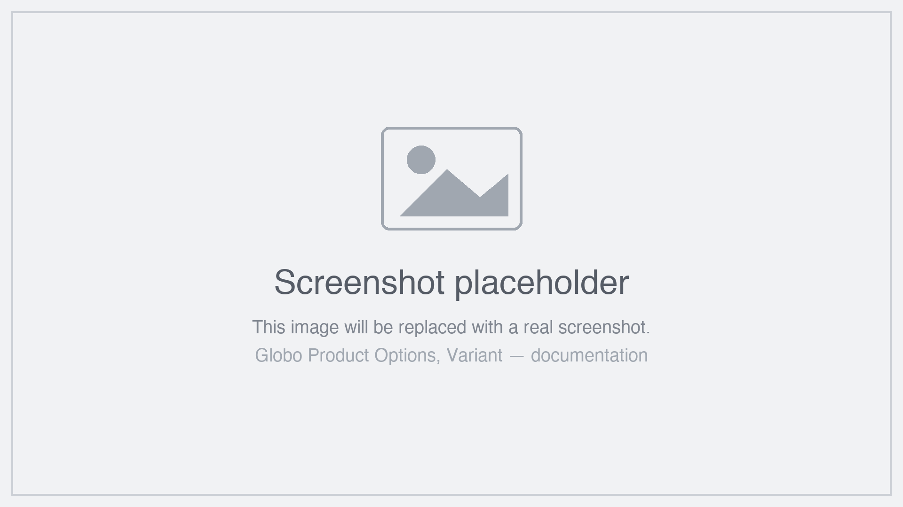

# Quickview and other pages

Product pages are not the only place shoppers buy. Three settings control the others, all in **Settings** > **Settings** > **General**.

## Collection page quickview

<table><thead><tr><th width="290">Setting</th><th width="130">Default</th><th>What it does</th></tr></thead><tbody><tr><td><strong>Show options on Quickview popups</strong></td><td>On</td><td>Renders your options inside the quickview popups on collection pages</td></tr></tbody></table>

Many themes let shoppers open a product in a popup straight from a collection page. Without this on, they can add to cart from there **without seeing your options at all** — which for a personalised product means an order you cannot fulfil.

Leave it on if your theme has quickviews. There is no downside beyond the app running on collection pages.


Quickviews are built differently by every theme, and some are added by other apps. The app handles the common patterns, but if your options do not appear in your quickview, that is worth reporting — see [Contact support](../help/contact-support.md).


## Home page and regular pages

<table><thead><tr><th width="330">Setting</th><th width="130">Default</th><th>Covers</th></tr></thead><tbody><tr><td><strong>Show widget on home page</strong></td><td>On</td><td>Featured product sections on your home page</td></tr><tr><td><strong>Show widget on regular page</strong></td><td>On</td><td>Featured product sections on other pages</td></tr></tbody></table>

Both are limited to **featured product sections** — a section that shows one product with its buy button. They do not add options to a general page.

For these to work you also need the app block placed in that section:



### Add a Featured product section

In the theme editor, on the page you want.



### Add the app block inside it

**Add block** > **Globo Product Options**. See [Add the app block](../getting-started/add-the-app-block.md).



### Check the block's Product setting

It fills itself in from the section, but confirm it points at the right product.



### Make sure the matching switch is on

**Show widget on home page** or **Show widget on regular page**.



### Test the page

Including adding to cart from it.



<!-- SCREENSHOT: store-other-pages | App admin → Settings → General | Nhóm Collection page và Other pages với các switch | Khoanh 2 nhóm -->

<figure><figcaption>
Three switches, covering quickviews and featured product sections.
</figcaption></figure>

## Why you might turn one off

The app notes that these settings cause its code to run on those pages. If you have no featured product sections and no quickviews, turning the relevant switches off means the app does nothing there.

Weigh that against the risk: a quickview that can add to cart without showing options is a real problem, and it usually outweighs the marginal saving.

## Where options do not appear

<table><thead><tr><th width="290">Place</th><th>Why</th></tr></thead><tbody><tr><td>Collection page product cards</td><td>There is no room and no context for a form. Quickview is the answer</td></tr><tr><td>Search results</td><td>Same</td></tr><tr><td>General page content, outside a featured product section</td><td>No product in context</td></tr><tr><td>Checkout</td><td>Options are collected before the cart. Their values <em>appear</em> at checkout — see <a href="show-options-on-orders.md">Show options on orders</a></td></tr><tr><td>Shopify's dynamic checkout buttons, such as accelerated payment</td><td>Those bypass the cart. The app hides them where options would otherwise be skipped</td></tr></tbody></table>

## Notes

* Store-wide, like all these settings.
* Each option set's own rules still apply on these pages — status, sales channel, and product, customer, and country rules.
* Quickview support depends on your theme, and on any quickview app you use.
* The cart page has its own settings. See [Cart page](cart-page.md).
