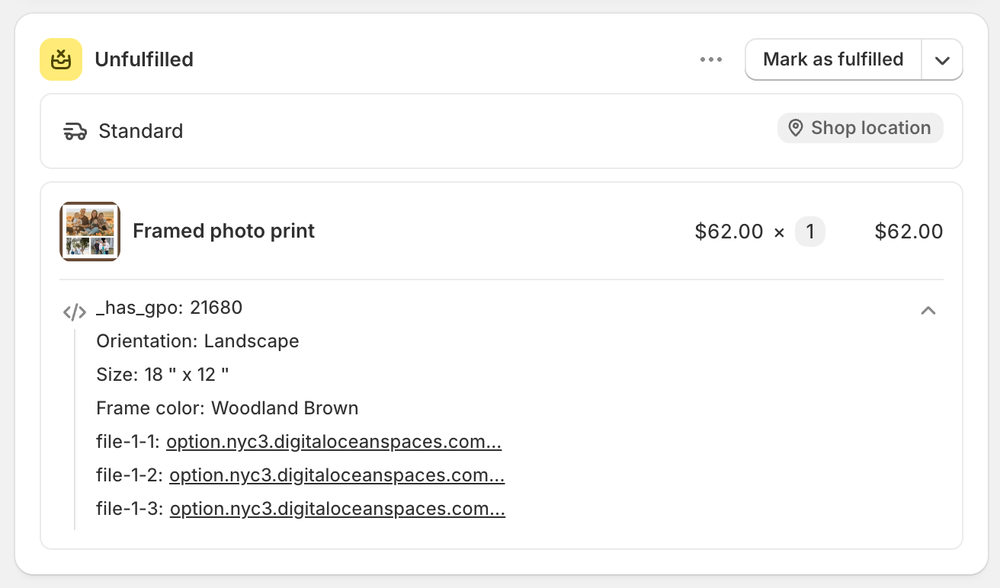

# Show options on orders

A customer's choices are stored with their order automatically. This page covers where they appear without any setup, and links to the four templates that need a small piece of Liquid added.

## Where they appear without setup

Option values are attached to the cart line as **line item properties**, which is Shopify's own mechanism for custom order details. Your options appear anywhere Shopify already displays line item properties:

<table><thead><tr><th width="290">Place</th><th>Shows</th></tr></thead><tbody><tr><td>The cart page</td><td>Each option's <strong>Name</strong> and the customer's value, under the item</td></tr><tr><td>Checkout</td><td>The same</td></tr><tr><td>The order in Shopify admin</td><td>The same, per line item</td></tr><tr><td>Order confirmation emails</td><td>Usually, depending on your notification templates</td></tr><tr><td>Uploaded files</td><td>As links, so your team can download the originals</td></tr></tbody></table>

The label displayed is the option's **Name**, not its Label. This is why the Name matters: `Size: 18" x12"` tells your team what to do, and `Frame color: Wooodland Brown` does not. See [Label and Name](../option-types/shared-settings/labels-and-visibility.md).

<figure><figcaption>
Option details reach the order with no configuration.
</figcaption></figure>

## Where they need a small addition

Invoices, packing slips, and notification emails use templates you control. If your template does not already print line item properties, add a small snippet to it.

Each of these has its own page, with the exact template, the download link, and the screenshots for that screen:

<table data-view="cards"><thead><tr><th></th><th></th><th data-hidden data-card-target data-type="content-ref"></th></tr></thead><tbody><tr><td><strong>Order invoice</strong></td><td>Printed invoices from Shopify's Order Printer app.</td><td><a href="order-invoice.md">order-invoice.md</a></td></tr><tr><td><strong>Packing slip</strong></td><td>Order Printer, or Shopify's own packing slip template in Settings.</td><td><a href="packing-slip.md">packing-slip.md</a></td></tr><tr><td><strong>Confirmation email</strong></td><td>The email your customer receives after placing an order.</td><td><a href="order-confirmation-email.md">order-confirmation-email.md</a></td></tr><tr><td><strong>Staff order notification</strong></td><td>The New order email you and your staff receive.</td><td><a href="staff-order-notification.md">staff-order-notification.md</a></td></tr></tbody></table>

The snippet is slightly different on each page, because invoices and packing slips loop over `line_item` while the notification emails loop over `line`. Use the one on the page for the template you are editing.

Whichever you use, the snippet does two things:

* **It skips properties whose name starts with an underscore.** Those are the app's internal properties, which link add-ons to their parent item and carry pricing data. Your team does not need to read them. See [How it works](../reference/how-it-works.md).
* **It displays uploaded files as links** rather than as long addresses, so a packing slip stays readable.


The snippet must go **inside** the template's loop over line items, where `line_item` or `line` exists. Outside that loop, it displays nothing.



These templates are your store's own paperwork and emails. Copy the existing template somewhere safe before you change it, so you can restore it.

If you have already customized a template, do not paste the full code over it. Merge the snippet into what you have.

If you would rather not edit them yourself, support can supply ready-made versions of these templates. See [Contact support](../help/contact-support.md).


If you use a different packing slip, invoice, or fulfillment app, the same approach works in any Liquid template where the line item is in scope.

## Alternative: use an automation

If you would rather not edit templates, a [workflow](../automations/) produces much of the same result without any Liquid:

<table><thead><tr><th width="290">Workflow</th><th>Result</th></tr></thead><tbody><tr><td><a href="../automations/email-notification.md">Email notification</a></td><td>Emails you every order with its options, in a format you control</td></tr><tr><td><a href="../automations/update-order-notes.md">Update order notes</a></td><td>Writes the options into the order's notes — and the note already appears on packing slips, invoices, and emails in most templates</td></tr><tr><td><a href="../automations/update-order-tags.md">Update order tags</a></td><td>Tags the order by the option chosen, so you can filter and route orders</td></tr></tbody></table>

**Update order notes** is the most useful of these. Most templates already print the order note, so writing the options into the note puts them on your paperwork without editing a template.

## Notes

* Option details on an order are a record of that order. Renaming an option later does not change orders that have already been placed.
* Uploaded files stay available from the order in Shopify admin.
* Add-on products appear as their own line items unless you merge them. See [Merge main product and add-ons](../add-on-pricing/merge-as-bundle.md).
* Properties whose name begins with an underscore are internal to the app. Do not print them or build processes around them.
