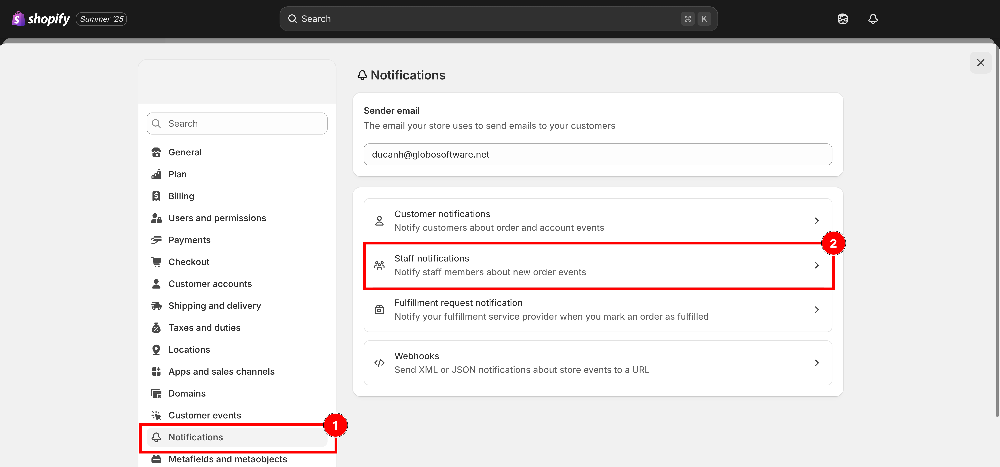
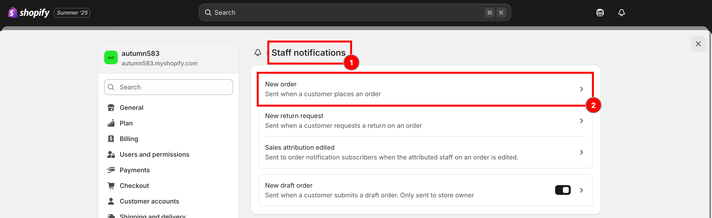
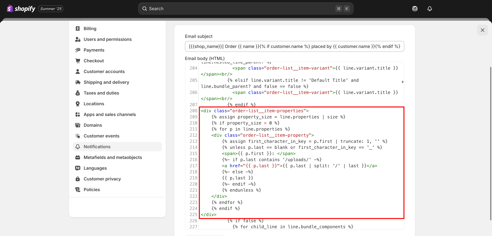

# Display option in staff order notification

This is the email the **store owner or staff** receives when a customer places a new order. To include product option details, you can customize the notification template by following these steps:



### From your **Shopify admin**, click **Settings**, Select **Notifications**

Scroll down to the **Staff Order Notifications** section

<figure><figcaption><p>Settings, Notifications, then Staff order notifications.</p></figcaption></figure>



### Click **New order**

<figure><figcaption><p>Open the New order notification.</p></figcaption></figure>



### **Download the New Order template** ([click this button to download](https://github.com/globo-software/display-cart-line-item-in-notification/blob/main/gpo-new-order-notification.liquid))



### Open the downloaded file and **copy the code**

```liquid
 <div class="order-list__item-properties">
	 
	 
	 
	<div class="order-list__item-property">
		
		 
		<span>{{ p.first }}: </span>
		 
		<a href="{{ p.last }}">{{ p.last | split: '/' | last }}</a> 
		 
		{{ p.last }} 
		 
		 
	</div> 
	
	 
</div>
```

**and Paste to Email body (HTML) box**

<figure><figcaption><p>Paste the snippet into the Email body (HTML) box.</p></figcaption></figure>



### **Save**




📧 **Need Help?**

If you run into any issues while setting up your option set, feel free to reach out to us at **Chat** or email [**contact@globo.io**](mailto:contact@globo.io).

See [Contact support](../help/contact-support.md).

