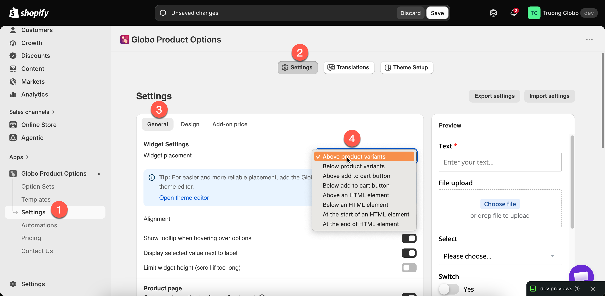

# Widget placement

Widget placement controls where the option widget appears on your product page. **Settings** > **Settings** > **General** > **Widget Settings** > **Widget placement**.

## The eight positions

Four positions are relative to elements every theme has. The other four are relative to an HTML element you specify.

<table><thead><tr><th width="330">Position</th><th>Puts the widget</th></tr></thead><tbody><tr><td><strong>Above product variants</strong></td><td>Before the variant pickers</td></tr><tr><td><strong>Below product variants</strong></td><td>After the variant pickers, before the buy buttons</td></tr><tr><td><strong>Above add to cart button</strong></td><td>Directly above the buy buttons. New stores start here</td></tr><tr><td><strong>Below add to cart button</strong></td><td>Directly below the buy buttons</td></tr><tr><td><strong>Above an HTML element</strong></td><td>Immediately before an element you specify</td></tr><tr><td><strong>Below an HTML element</strong></td><td>Immediately after it</td></tr><tr><td><strong>At the start of an HTML element</strong></td><td>Inside it, as its first content</td></tr><tr><td><strong>At the end of an HTML element</strong></td><td>Inside it, as its last content</td></tr></tbody></table>

The four custom positions display a **Selector of the HTML element** field, where you enter a CSS selector such as `#addToCart`.

<figure><figcaption></figcaption></figure>

## Which to choose

<table><thead><tr><th width="330">You want</th><th>Choose</th></tr></thead><tbody><tr><td>The most reliable default</td><td><strong>Above add to cart button</strong> — options are read before the customer commits</td></tr><tr><td>Options grouped with the variant pickers</td><td><strong>Below product variants</strong></td></tr><tr><td>Options before the customer picks a variant</td><td><strong>Above product variants</strong> — rarely right, since variant choice usually comes first</td></tr><tr><td>Options after the buy buttons</td><td><strong>Below add to cart button</strong> — only if your theme puts something useful there. Customers may miss them</td></tr><tr><td>An exact position none of the above gives</td><td>An <a href="../getting-started/add-the-app-block.md">app block</a> first, and a custom selector only if the block will not do</td></tr></tbody></table>


**Try the app block before a CSS selector.** You drag an [app block](../getting-started/add-the-app-block.md) into position in the theme editor, and there is no selector to maintain. A selector depends on your theme's internal structure, and a theme update can change it.

The placement setting includes a tip that points to the theme editor.


## Using a custom selector



### Find the element

On your product page, use your browser's inspector to find the element you want to place the widget against. Look for a stable `id` or a distinctive class.



### Choose the relationship

**Above** and **Below** place the widget outside the element. **At the start of** and **At the end of** place it inside.



### Enter the selector

Enter it in **Selector of the HTML element**, for example `#addToCart` or `.product-form__buttons`.



### Save and check a real product page

If the widget does not appear, the selector does not match anything. Check it in your browser's inspector.



### Record the selector you used

A theme update can change the markup. Knowing which selector you used makes the widget quick to fix.



## Placement on other page types

The setting above applies to product pages. Other pages have their own settings:

<table><thead><tr><th width="330">Page</th><th>Controlled by</th></tr></thead><tbody><tr><td>Collection quickview popups</td><td><strong>Show options on Quickview popups</strong>. See <a href="quickview-and-other-pages.md">Quickview and other pages</a></td></tr><tr><td>Home page, featured product section</td><td><strong>Show widget on home page</strong>, plus an <a href="../getting-started/add-the-app-block.md">app block</a> in that section</td></tr><tr><td>Regular pages, featured product section</td><td><strong>Show widget on regular page</strong>, plus an app block</td></tr><tr><td>Cart page</td><td>Its own settings. See <a href="cart-page.md">Cart page</a></td></tr></tbody></table>

## Notes

* Placement is store-wide. Every option set uses the same position.
* Adding an [app block](../getting-started/add-the-app-block.md) does not disable automatic placement. If the widget appears twice, remove one of them.
* If a selector matches several elements, the widget is placed against the first one.
* Changing the placement does not affect the options themselves or how they behave.
