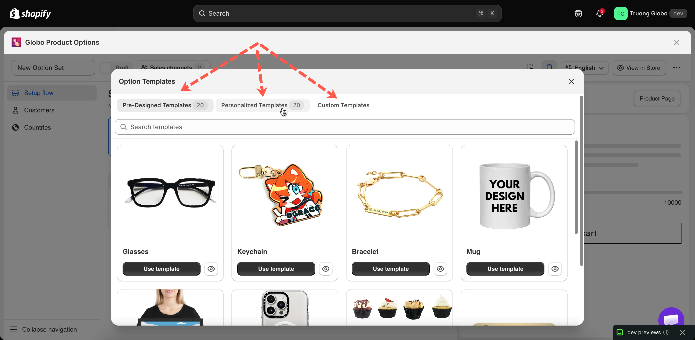
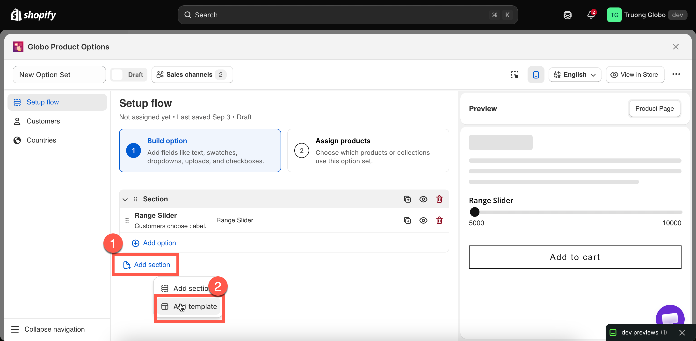

# Overview

A template is a saved option set you can copy. Use it to avoid rebuilding the same structure for every product family, and to see how a complete setup is configured.

**Templates** in the app menu contains three tabs.

<table data-view="cards"><thead><tr><th></th><th></th><th data-hidden data-card-target data-type="content-ref"></th></tr></thead><tbody><tr><td><strong>Pre-designed Templates</strong></td><td>Start from one of twenty ready-made option sets for common product types.</td><td><a href="pre-designed-templates.md">pre-designed-templates.md</a></td></tr><tr><td><strong>Personalized Templates</strong></td><td>Start from a setup that already has the live preview configured.</td><td><a href="personalized-templates.md">personalized-templates.md</a></td></tr><tr><td><strong>Custom Templates</strong></td><td>Templates you create, or save from an existing option set.</td><td><a href="custom-templates.md">custom-templates.md</a></td></tr></tbody></table>

<figure><figcaption></figcaption></figure>

## Template or option set?

<table><thead><tr><th width="230"></th><th width="290">Option set</th><th>Template</th></tr></thead><tbody><tr><td>Appears on your storefront</td><td>Yes, when active and assigned</td><td>No, ever</td></tr><tr><td>Has product, customer, and country rules</td><td>Yes</td><td>No</td></tr><tr><td>Purpose</td><td>The live form customers use</td><td>A starting point to copy</td></tr><tr><td>Where it lives</td><td><strong>Option Sets</strong></td><td><strong>Templates</strong></td></tr></tbody></table>

A template is never displayed on your storefront. Using one creates a new option set, and that option set goes live.

## When to use a template

<table><thead><tr><th width="330">Situation</th><th>Do this</th></tr></thead><tbody><tr><td>You are new to the app and want to see a real setup</td><td>Use a pre-designed template and take it apart</td></tr><tr><td>You sell something the library covers</td><td>Use that template and adapt it</td></tr><tr><td>You have built a setup you will repeat for other product families</td><td>Save it as a custom template</td></tr><tr><td>You want the same structure twice with different targeting</td><td><a href="../option-sets/duplicate-and-delete.md">Duplicate the option set</a> — quicker than going via a template</td></tr><tr><td>You want to insert a group of options into a set you are already building</td><td>Use <strong>Add template</strong> in the builder's add picker</td></tr></tbody></table>

## Inserting a template into an existing option set

You do not have to start from a template. While building, the add picker has an **Option Templates** tab and an **Add template** action, which inserts a saved group of options into the current option set.

Names that match existing options are renumbered automatically, and conditional logic inside the template is updated so it continues to work.

See [Build your options](../option-sets/build-options.md).

<figure><figcaption></figcaption></figure>

## Notes

* Templates may not be available on all plans. See [Compare plans](../plans/compare-plans.md).
* Using a template does not modify the original. You can reuse the same template as often as you need.
* A new option set created from a template is **Draft** and has no product rule, so it is not displayed on your storefront until you set both.
* Custom templates can be imported and exported, separately from option sets.
