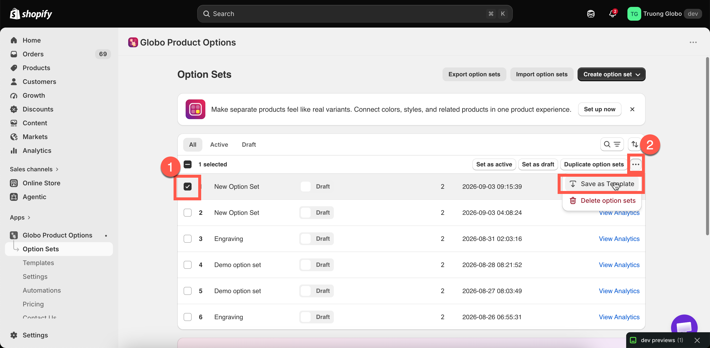
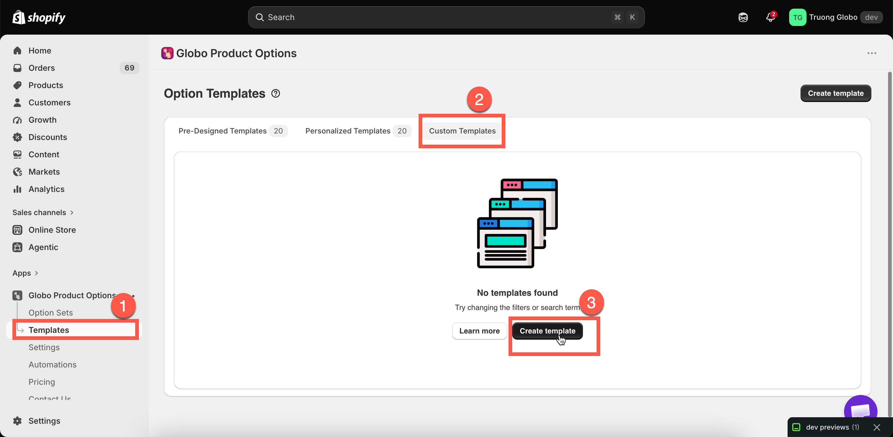

# Custom templates

A custom template is a template you create. After you build a setup that works, save it so your next product family starts from that setup rather than from an empty option set.

## Two ways to create one

<table><thead><tr><th width="290">Route</th><th>Use when</th></tr></thead><tbody><tr><td><strong>Save as Template</strong> from an existing option set</td><td>You have already built something that works. This is the usual route</td></tr><tr><td><strong>Create template</strong> from scratch</td><td>You want a reusable block that was never a live option set — a standard gift-options group, say</td></tr></tbody></table>

### Save an option set as a template



### Select the option sets

On the **Option Sets** list, select one or more rows. You can also do this from the builder's more-actions menu.



### Choose Save as Template

From the bulk action menu on the list, or the builder's more-actions menu.



### Find it under Custom Templates

**Templates** > **Custom Templates**.



<figure><figcaption></figcaption></figure>

### Create one from scratch

**Templates** > **Create template**. The builder opens in template mode.

Template mode differs from an option set in one way: there is no **Setup flow**, and no product, customer, or country rules. A template has no targeting, because it is never displayed on your storefront. It only has options. The left rail shows **Elements** instead.

<figure><figcaption></figcaption></figure>

## Using a custom template

There are two methods, and they produce different results.

<table><thead><tr><th width="290">Route</th><th>Result</th></tr></thead><tbody><tr><td><strong>Use template</strong> from the Templates page</td><td>Creates a whole new option set from it</td></tr><tr><td><strong>Add template</strong> in the builder's add picker</td><td>Inserts its options into the option set you are already building</td></tr></tbody></table>

The second method is more useful once you have several templates. Inserting a standard "gift options" template into five option sets keeps those product families consistent, and you only build it once.

When you insert a template, names that match existing options are renumbered automatically, and conditional logic inside the template is updated so it continues to work. Check the names afterwards and set readable values.

## Managing them

The **Custom Templates** tab lists your templates, in the same format as the option sets list.

<table><thead><tr><th width="230">Action</th><th>What it does</th></tr></thead><tbody><tr><td>Search and sort</td><td>By name, or by date created</td></tr><tr><td>Open</td><td>Edit the template's options</td></tr><tr><td><strong>Duplicate templates</strong></td><td>Copy one or more</td></tr><tr><td><strong>Delete templates</strong></td><td>Permanently remove them. Confirmed first</td></tr><tr><td>Import and export</td><td>Move templates between stores</td></tr></tbody></table>

Each row lists the option types the template contains, so you do not have to open it.


Deleting a template does **not** affect option sets created from it. An option set created from a template is independent and is not linked to it.


## A useful set of templates

Three templates cover most of what a personalization store reuses:

<table><thead><tr><th width="290">Template</th><th>Contains</th></tr></thead><tbody><tr><td><code>Gift options</code></td><td>A gift-wrap switch, a gift message textarea with a conditional rule, and a recipient email</td></tr><tr><td><code>Engraving block</code></td><td>An engraving text field with your limits and input rules, a font picker with your fonts, and a position choice</td></tr><tr><td><code>Delivery preferences</code></td><td>A date picker with your lead time and blocked days, plus a delivery notes field</td></tr></tbody></table>

Insert the template you need into each new option set. Your wording, limits, and fonts then stay consistent across the store.

## Notes

* Custom templates may not be available on all plans. See [Compare plans](../plans/compare-plans.md).
* A template has no product, customer, or country rules — only options.
* Add-on products used by a template's options work in the same way as elsewhere. An existing-product link points at the same product, and a generated product is shared. See [Add-on pricing](../add-on-pricing/).
* Templates are imported and exported separately from option sets. See [Import and export](../option-sets/import-and-export.md).
