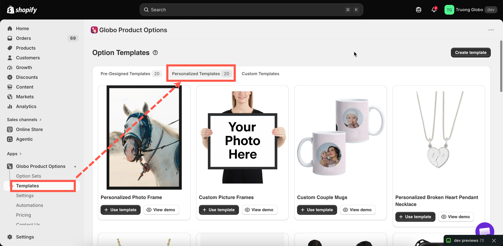

# Personalized templates

The app includes twenty complete personalized option sets. Each one has its options, its background, and its layers already positioned for a particular type of product.

Adapting one is faster than starting from an empty canvas, and it shows you how a complete setup is configured.

## Where they are

**Templates** in the app menu, then the **Personalized Templates** tab.

The other two tabs are [Pre-designed templates](pre-designed-templates.md), which are option sets without personalization, and [Custom templates](custom-templates.md), which are your own.

<figure><figcaption>
Twenty personalized setups, each with a preview and a demo.
</figcaption></figure>

## The twenty templates

<table><thead><tr><th width="290">Template</th><th>Product it is built for</th></tr></thead><tbody><tr><td>Personalized Photo Frame</td><td>A frame with a customer photo</td></tr><tr><td>Custom Picture Frames</td><td>A frame with size and mount choices</td></tr><tr><td>Custom Couple Mugs</td><td>Mugs with names, curved to the surface</td></tr><tr><td>Personalized Broken Heart Pendant Necklace</td><td>A two-part engraved pendant</td></tr><tr><td>Personalized Birthstone Pendant</td><td>A pendant with a stone choice and engraving</td></tr><tr><td>Custom T-Shirts</td><td>Printed text and artwork on a garment</td></tr><tr><td>Custom Football Jerseys</td><td>A name and number on a shirt</td></tr><tr><td>Custom Phone Case</td><td>An uploaded image on a case</td></tr><tr><td>Embroidered Bag</td><td>An embroidered name or initials</td></tr><tr><td>Personalized Wooden Bears Family</td><td>Several names on a multi-part item</td></tr><tr><td>Custom LED Acrylic Light Stands</td><td>Engraved text on an illuminated panel</td></tr><tr><td>Unisex Crocs Classic</td><td>Personalized footwear</td></tr><tr><td>Personalized Tie</td><td>An embroidered monogram</td></tr><tr><td>Custom Notebook</td><td>A name on a cover</td></tr><tr><td>Engraved Pen</td><td>A short engraving on a small surface</td></tr><tr><td>Personalized Cushion</td><td>Printed text and images on fabric</td></tr><tr><td>Personalized Wooden Serving Platter</td><td>Engraving on wood</td></tr><tr><td>Personalized BBQ Fork</td><td>A short engraving on a narrow surface</td></tr><tr><td>Personalized Trophy Gold</td><td>Engraved presentation text</td></tr><tr><td>Personalized Wooden Ramp Racer Toy</td><td>A name on a toy</td></tr></tbody></table>

## Using a template



### Open the demo first

Each template includes a demo, so you can see the finished behavior on a storefront before you use it.



### Select Use template

A new option set is created from the template, and the builder opens.



### Rename it

Name the option set after your products rather than the template.



### Replace the background with your own product

This is the most important step. The template's layers are positioned against its own demo image, so they do not line up with your photograph.

Open **Change background**, select **Product image**, and select one of your own products. See [Choosing the background](../personalizer/setup.md#choosing-the-background).



### Reposition every layer

Go through each personalized option and adjust its position and size against your image.



### Adjust the options themselves

Set your own character limits, fonts, and prices. Templates contain example values.



### Assign it to your products

Set a rule on **Assign products**. A template has no product rule. See [Assign to products](../option-sets/assign-to-products.md).



### Save, activate, and test on a real product page

Use **View in Store**.



## What to check after using a template

<table><thead><tr><th width="290">Check</th><th>Why</th></tr></thead><tbody><tr><td>The background is your product</td><td>Otherwise every layer is positioned for somebody else's photograph</td></tr><tr><td>Every layer's position</td><td>The single biggest source of "the template looks wrong"</td></tr><tr><td>Character limits</td><td>The template's limit reflects its example product, not your engraving area</td></tr><tr><td>Fonts</td><td>Change them to fonts you can actually produce. See <a href="../personalizer/layer-settings/fonts.md">Fonts</a></td></tr><tr><td>Prices</td><td>Templates carry example prices, or none</td></tr><tr><td>Option <strong>Name</strong> fields</td><td>So your orders read properly. See <a href="../option-types/shared-settings/labels-and-visibility.md">Label and Name</a></td></tr><tr><td>The product rule</td><td>A template arrives unassigned</td></tr></tbody></table>

## Choosing a template

Select a template by the **structure of the design** rather than by the product name. For example, if you sell engraved hip flasks, the closest template is not the one named after a flask. It is the one with a short engraving on a small curved surface, probably the pen or the BBQ fork.

<table><thead><tr><th width="290">Your product needs</th><th>Start from</th></tr></thead><tbody><tr><td>A customer photo in a window</td><td>Personalized Photo Frame, Custom Phone Case</td></tr><tr><td>Text curved around a surface</td><td>Custom Couple Mugs</td></tr><tr><td>A name and a number</td><td>Custom Football Jerseys</td></tr><tr><td>A short engraving on a small area</td><td>Engraved Pen, Personalized BBQ Fork</td></tr><tr><td>Several names on one item</td><td>Personalized Wooden Bears Family</td></tr><tr><td>Text plus artwork on fabric</td><td>Custom T-Shirts, Personalized Cushion</td></tr></tbody></table>

## Notes

* Using a template creates a new option set. It does not modify the template, and you can use the same template as often as you need.
* A new option set created from a template is **Draft** and has no product rule, so it is not displayed on your storefront until you set both.
* Personalized templates require the Personalizer, which may not be available on all plans. Without it, the option set is created, but the layers are not drawn.
* After adapting a template to your products, save it as a [custom template](custom-templates.md), so your next product starts from your version.
